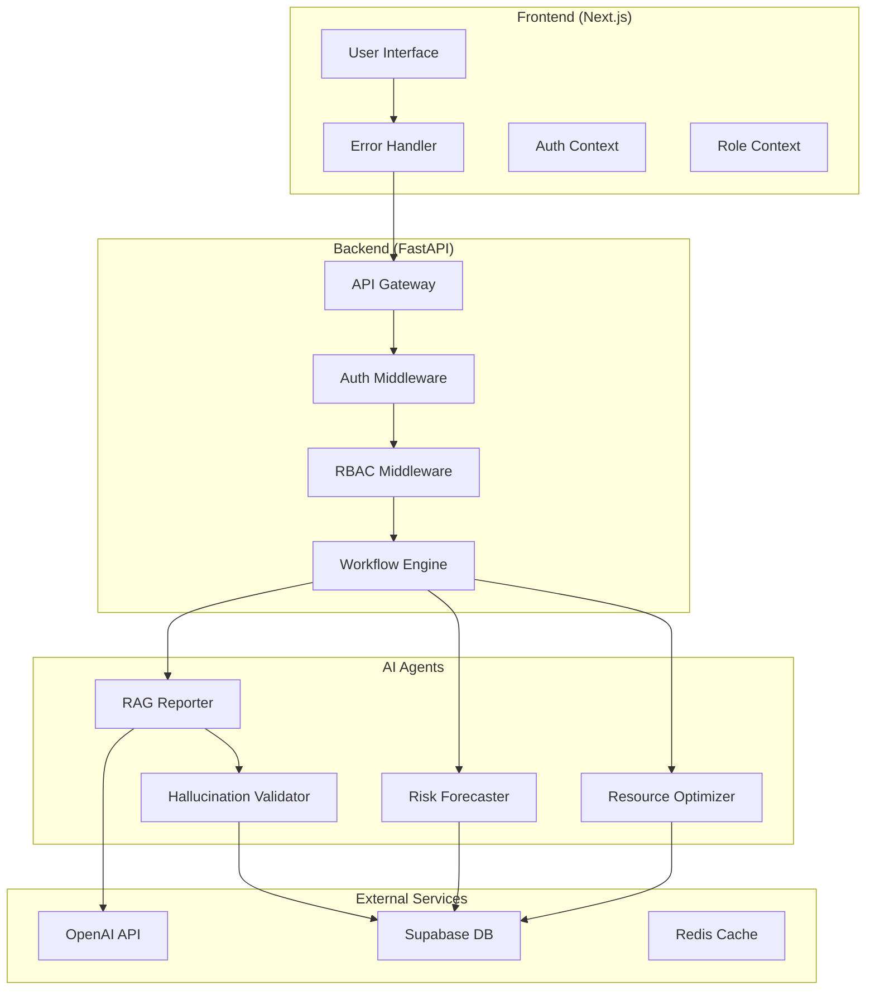
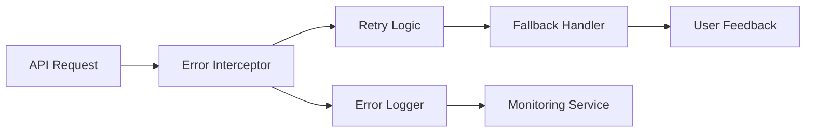

# Design Document: AI Chat Fixes and Missing Features

## Overview

This design document outlines the technical implementation for fixing AI chat errors and adding the missing core features to the PPM SaaS platform. The solution focuses on robust error handling, comprehensive AI agent implementation, and production-ready features including RBAC, workflow engine, and property-based testing.

## Architecture

### System Architecture Overview



### Error Handling Architecture



## Components and Interfaces

### 1. Enhanced Error Handler Component

**Location**: `frontend/lib/error-handler.ts`

```typescript
interface ErrorHandlerConfig {
  maxRetries: number
  retryDelay: number
  fallbackMessage: string
  enableLogging: boolean
}

interface APIError {
  code: string
  message: string
  details?: unknown
  timestamp: Date
  requestId?: string
}

class ErrorHandler {
  async handleAPIError(error: APIError): Promise<ErrorResponse>
  async retryWithBackoff<T>(fn: () => Promise<T>, maxRetries: number): Promise<T>
  logError(error: APIError, context: Record<string, unknown>): void
  getUserFriendlyMessage(error: APIError): string
}
```

### 2. AI Agent Base Architecture

**Location**: `backend/agents/base.py`

```python
from abc import ABC, abstractmethod
from typing import Dict, Any, List, Optional
from pydantic import BaseModel

class AgentResponse(BaseModel):
    success: bool
    data: Dict[str, Any]
    confidence: float
    sources: List[Dict[str, Any]]
    execution_time_ms: int
    error_message: Optional[str] = None

class BaseAIAgent(ABC):
    def __init__(self, config: Dict[str, Any]):
        self.config = config
        self.metrics = AgentMetrics()
    
    @abstractmethod
    async def process(self, input_data: Dict[str, Any]) -> AgentResponse:
        pass
    
    async def validate_input(self, input_data: Dict[str, Any]) -> bool:
        pass
    
    async def log_metrics(self, response: AgentResponse) -> None:
        pass
```

### 3. Resource Optimizer Agent

**Location**: `backend/agents/resource_optimizer.py`

```python
from crewai import Agent, Task, Crew
from langchain.tools import Tool

class ResourceOptimizerAgent(BaseAIAgent):
    def __init__(self, config: Dict[str, Any]):
        super().__init__(config)
        self.skill_matcher = self._create_skill_matcher_agent()
        self.allocation_optimizer = self._create_allocation_agent()
        self.crew = Crew(
            agents=[self.skill_matcher, self.allocation_optimizer],
            tasks=[],
            verbose=True
        )
    
    async def optimize_allocation(self, project_requirements: List[Dict]) -> AgentResponse:
        # Implementation details in code section
        pass
    
    def _create_skill_matcher_agent(self) -> Agent:
        return Agent(
            role='Skill Matching Specialist',
            goal='Match project requirements with available resources based on skills',
            backstory='Expert in analyzing skill requirements and resource capabilities',
            tools=[self._get_skills_analysis_tool()]
        )
```

### 4. Risk Forecaster Agent

**Location**: `backend/agents/risk_forecaster.py`

```python
import pandas as pd
from sklearn.ensemble import RandomForestClassifier
from sklearn.preprocessing import StandardScaler

class RiskForecasterAgent(BaseAIAgent):
    def __init__(self, config: Dict[str, Any]):
        super().__init__(config)
        self.model = RandomForestClassifier(n_estimators=100, random_state=42)
        self.scaler = StandardScaler()
        self.risk_patterns = RiskPatternAnalyzer()
    
    async def forecast_risks(self, project_data: Dict[str, Any]) -> AgentResponse:
        # Historical analysis
        historical_data = await self._get_historical_data()
        
        # Feature engineering
        features = self._extract_features(project_data, historical_data)
        
        # Risk prediction
        risk_probability = self.model.predict_proba(features)
        
        # Generate recommendations
        recommendations = await self._generate_mitigation_strategies(risk_probability)
        
        return AgentResponse(
            success=True,
            data={
                'risk_probability': risk_probability.tolist(),
                'risk_factors': features,
                'recommendations': recommendations
            },
            confidence=self._calculate_confidence(risk_probability),
            sources=self._get_data_sources(),
            execution_time_ms=self._get_execution_time()
        )
```

### 5. Workflow Engine

**Location**: `backend/workflow/engine.py`

```python
from enum import Enum
from typing import List, Dict, Any, Optional
from pydantic import BaseModel

class WorkflowStatus(Enum):
    PENDING = "pending"
    IN_PROGRESS = "in_progress"
    APPROVED = "approved"
    REJECTED = "rejected"
    CANCELLED = "cancelled"

class WorkflowStep(BaseModel):
    id: str
    name: str
    type: str  # 'approval', 'notification', 'action'
    assignee_role: str
    conditions: Dict[str, Any]
    timeout_hours: Optional[int] = None

class WorkflowTemplate(BaseModel):
    id: str
    name: str
    description: str
    steps: List[WorkflowStep]
    parallel_execution: bool = False

class WorkflowEngine:
    async def create_workflow(self, template_id: str, context: Dict[str, Any]) -> str:
        pass
    
    async def process_step(self, workflow_id: str, step_id: str, decision: str) -> bool:
        pass
    
    async def get_pending_approvals(self, user_id: str) -> List[Dict[str, Any]]:
        pass
```

### 6. RBAC System

**Location**: `backend/auth/rbac.py`

```python
from enum import Enum
from typing import List, Set
from functools import wraps

class Role(Enum):
    ADMIN = "admin"
    MANAGER = "manager"
    VIEWER = "viewer"

class Permission(Enum):
    READ_PROJECTS = "read:projects"
    WRITE_PROJECTS = "write:projects"
    DELETE_PROJECTS = "delete:projects"
    READ_RESOURCES = "read:resources"
    WRITE_RESOURCES = "write:resources"
    READ_FINANCIALS = "read:financials"
    WRITE_FINANCIALS = "write:financials"
    ADMIN_USERS = "admin:users"

ROLE_PERMISSIONS = {
    Role.ADMIN: set(Permission),
    Role.MANAGER: {
        Permission.READ_PROJECTS, Permission.WRITE_PROJECTS,
        Permission.READ_RESOURCES, Permission.WRITE_RESOURCES,
        Permission.READ_FINANCIALS, Permission.WRITE_FINANCIALS
    },
    Role.VIEWER: {
        Permission.READ_PROJECTS, Permission.READ_RESOURCES, Permission.READ_FINANCIALS
    }
}

def require_permission(permission: Permission):
    def decorator(func):
        @wraps(func)
        async def wrapper(*args, **kwargs):
            # Permission check implementation
            pass
        return wrapper
    return decorator
```

## Data Models

### Enhanced Database Schema

```sql
-- Enhanced AI agent metrics
CREATE TABLE ai_agent_metrics (
    id UUID PRIMARY KEY DEFAULT gen_random_uuid(),
    agent_type VARCHAR(50) NOT NULL,
    operation VARCHAR(100) NOT NULL,
    user_id UUID REFERENCES auth.users(id),
    input_tokens INTEGER DEFAULT 0,
    output_tokens INTEGER DEFAULT 0,
    response_time_ms INTEGER DEFAULT 0,
    success BOOLEAN DEFAULT true,
    error_message TEXT,
    confidence_score FLOAT,
    request_id UUID,
    created_at TIMESTAMP DEFAULT NOW()
);

-- Workflow engine tables
CREATE TABLE workflow_templates (
    id UUID PRIMARY KEY DEFAULT gen_random_uuid(),
    name VARCHAR(255) NOT NULL,
    description TEXT,
    steps JSONB NOT NULL,
    parallel_execution BOOLEAN DEFAULT false,
    created_by UUID REFERENCES auth.users(id),
    created_at TIMESTAMP DEFAULT NOW(),
    updated_at TIMESTAMP DEFAULT NOW()
);

CREATE TABLE workflow_instances (
    id UUID PRIMARY KEY DEFAULT gen_random_uuid(),
    template_id UUID REFERENCES workflow_templates(id),
    status VARCHAR(50) DEFAULT 'pending',
    context JSONB NOT NULL,
    current_step INTEGER DEFAULT 0,
    created_by UUID REFERENCES auth.users(id),
    created_at TIMESTAMP DEFAULT NOW(),
    updated_at TIMESTAMP DEFAULT NOW()
);

CREATE TABLE workflow_approvals (
    id UUID PRIMARY KEY DEFAULT gen_random_uuid(),
    workflow_id UUID REFERENCES workflow_instances(id),
    step_id VARCHAR(100) NOT NULL,
    assignee_id UUID REFERENCES auth.users(id),
    status VARCHAR(50) DEFAULT 'pending',
    decision VARCHAR(50),
    comments TEXT,
    decided_at TIMESTAMP,
    created_at TIMESTAMP DEFAULT NOW()
);

-- RBAC tables
CREATE TABLE user_roles (
    id UUID PRIMARY KEY DEFAULT gen_random_uuid(),
    user_id UUID REFERENCES auth.users(id),
    role VARCHAR(50) NOT NULL,
    granted_by UUID REFERENCES auth.users(id),
    granted_at TIMESTAMP DEFAULT NOW(),
    expires_at TIMESTAMP,
    UNIQUE(user_id, role)
);

CREATE TABLE role_permissions (
    id UUID PRIMARY KEY DEFAULT gen_random_uuid(),
    role VARCHAR(50) NOT NULL,
    permission VARCHAR(100) NOT NULL,
    resource_type VARCHAR(50),
    resource_id UUID,
    created_at TIMESTAMP DEFAULT NOW(),
    UNIQUE(role, permission, resource_type, resource_id)
);

-- Enhanced multi-currency support
CREATE TABLE currencies (
    code VARCHAR(3) PRIMARY KEY,
    name VARCHAR(100) NOT NULL,
    symbol VARCHAR(10) NOT NULL,
    decimal_places INTEGER DEFAULT 2,
    is_active BOOLEAN DEFAULT true,
    created_at TIMESTAMP DEFAULT NOW()
);

CREATE TABLE exchange_rates (
    id UUID PRIMARY KEY DEFAULT gen_random_uuid(),
    from_currency VARCHAR(3) REFERENCES currencies(code),
    to_currency VARCHAR(3) REFERENCES currencies(code),
    rate DECIMAL(15, 8) NOT NULL,
    date DATE NOT NULL,
    source VARCHAR(50) DEFAULT 'manual',
    created_at TIMESTAMP DEFAULT NOW(),
    UNIQUE(from_currency, to_currency, date)
);

-- Enhanced error logging
CREATE TABLE error_logs (
    id UUID PRIMARY KEY DEFAULT gen_random_uuid(),
    error_code VARCHAR(50),
    error_message TEXT NOT NULL,
    stack_trace TEXT,
    user_id UUID REFERENCES auth.users(id),
    request_id UUID,
    endpoint VARCHAR(255),
    method VARCHAR(10),
    status_code INTEGER,
    user_agent TEXT,
    ip_address INET,
    context JSONB,
    created_at TIMESTAMP DEFAULT NOW()
);

-- Bulk operations tracking
CREATE TABLE bulk_operations (
    id UUID PRIMARY KEY DEFAULT gen_random_uuid(),
    operation_type VARCHAR(50) NOT NULL,
    user_id UUID REFERENCES auth.users(id),
    total_items INTEGER NOT NULL,
    processed_items INTEGER DEFAULT 0,
    failed_items INTEGER DEFAULT 0,
    status VARCHAR(50) DEFAULT 'pending',
    results JSONB,
    error_details JSONB,
    created_at TIMESTAMP DEFAULT NOW(),
    completed_at TIMESTAMP
);
```

## Correctness Properties

*A property is a characteristic or behavior that should hold true across all valid executions of a system-essentially, a formal statement about what the system should do. Properties serve as the bridge between human-readable specifications and machine-verifiable correctness guarantees.*

<function_calls>
<invoke name="prework">
<parameter name="featureName">ai-chat-fixes-and-missing-features

### Property Reflection

After reviewing all properties identified in the prework analysis, I've identified several areas where properties can be consolidated:

**Consolidation Opportunities:**
- Properties 1.1, 1.2, and 1.3 can be combined into a comprehensive error handling property
- Properties 2.1, 2.2, and 2.3 can be combined into a resource optimization property
- Properties 3.1 and 3.2 can be combined into a risk forecasting property
- Properties 4.1 and 4.2 can be combined into a validation property
- Properties 8.1, 8.2, and 8.3 can be combined into a multi-currency property
- Properties 9.1 and 9.2 can be combined into a bulk operations property
- Properties 10.1 and 10.2 can be combined into a monitoring property

This consolidation reduces redundancy while ensuring comprehensive coverage of all requirements.

### Correctness Properties

Property 1: Error Handling Consistency
*For any* API request failure, network error, or service unavailability, the error handler should always provide user-friendly messages, retry options with exponential backoff, and appropriate fallback mechanisms
**Validates: Requirements 1.1, 1.2, 1.3**

Property 2: Resource Optimization Completeness
*For any* resource optimization request, the system should analyze current allocation patterns, consider both proficiency levels and availability in skill matching, and provide suggestions with confidence scores and reasoning
**Validates: Requirements 2.1, 2.2, 2.3**

Property 3: Risk Forecasting Accuracy
*For any* project data analysis, the risk forecaster should identify patterns from historical data and use both statistical models and trend analysis for probability calculations
**Validates: Requirements 3.1, 3.2**

Property 4: AI Response Validation
*For any* AI-generated response, the hallucination validator should fact-check claims against the database and assign confidence scores to each claim
**Validates: Requirements 4.1, 4.2**

Property 5: Workflow Engine Consistency
*For any* workflow creation or approval routing, the system should support both sequential and parallel patterns and follow predefined templates and rules
**Validates: Requirements 5.1, 5.2**

Property 6: RBAC Permission Enforcement
*For any* user role assignment or endpoint access, the system should enforce appropriate admin/manager/viewer permissions and validate role-based access
**Validates: Requirements 6.1, 6.2**

Property 7: Multi-Currency Calculation Consistency
*For any* financial data entry, display, or calculation, the system should support multiple currencies, show values in user's preferred currency, and use real-time exchange rates for conversions
**Validates: Requirements 8.1, 8.2, 8.3**

Property 8: Bulk Operations Reliability
*For any* multi-item selection or bulk update operation, the system should provide bulk action options and show progress indicators with validation
**Validates: Requirements 9.1, 9.2**

Property 9: Monitoring and Logging Completeness
*For any* error occurrence or performance monitoring, the system should log detailed information with context and track response times and success rates
**Validates: Requirements 10.1, 10.2**

## Error Handling

### Error Classification System

```typescript
enum ErrorType {
  NETWORK_ERROR = 'NETWORK_ERROR',
  API_ERROR = 'API_ERROR',
  VALIDATION_ERROR = 'VALIDATION_ERROR',
  AUTHENTICATION_ERROR = 'AUTHENTICATION_ERROR',
  AUTHORIZATION_ERROR = 'AUTHORIZATION_ERROR',
  AI_SERVICE_ERROR = 'AI_SERVICE_ERROR',
  DATABASE_ERROR = 'DATABASE_ERROR',
  UNKNOWN_ERROR = 'UNKNOWN_ERROR'
}

interface ErrorContext {
  requestId: string
  userId?: string
  endpoint: string
  timestamp: Date
  userAgent: string
  additionalData?: Record<string, unknown>
}
```

### Retry Strategy Implementation

```typescript
class RetryStrategy {
  private maxRetries = 3
  private baseDelay = 1000 // 1 second
  private maxDelay = 30000 // 30 seconds
  
  async executeWithRetry<T>(
    operation: () => Promise<T>,
    errorType: ErrorType
  ): Promise<T> {
    let lastError: Error
    
    for (let attempt = 0; attempt <= this.maxRetries; attempt++) {
      try {
        return await operation()
      } catch (error) {
        lastError = error as Error
        
        if (attempt === this.maxRetries || !this.shouldRetry(error, errorType)) {
          throw lastError
        }
        
        const delay = Math.min(
          this.baseDelay * Math.pow(2, attempt),
          this.maxDelay
        )
        
        await this.sleep(delay)
      }
    }
    
    throw lastError!
  }
  
  private shouldRetry(error: Error, errorType: ErrorType): boolean {
    const retryableErrors = [
      ErrorType.NETWORK_ERROR,
      ErrorType.AI_SERVICE_ERROR,
      ErrorType.DATABASE_ERROR
    ]
    
    return retryableErrors.includes(errorType)
  }
}
```

### Fallback Mechanisms

```typescript
class FallbackHandler {
  async handleAIServiceFallback(query: string): Promise<AIResponse> {
    return {
      response: `I'm currently unable to process your request due to AI service unavailability. 
                 Your query "${query}" has been logged and will be processed when the service is restored.`,
      sources: [],
      confidence_score: 0,
      conversation_id: `fallback_${Date.now()}`,
      response_time_ms: 0,
      status: 'ai_unavailable'
    }
  }
  
  async handleDatabaseFallback(): Promise<any[]> {
    return []
  }
  
  async handleNetworkFallback(): Promise<void> {
    // Store request for later retry
    await this.storeOfflineRequest()
  }
}
```

## Testing Strategy

### Property-Based Testing Framework

**Backend Testing (pytest + hypothesis)**

```python
# backend/tests/test_properties.py
from hypothesis import given, strategies as st
import pytest
from fastapi.testclient import TestClient

@given(
    error_type=st.sampled_from(['network', 'api', 'validation']),
    error_message=st.text(min_size=1, max_size=1000)
)
def test_error_handler_always_returns_user_friendly_message(error_type, error_message):
    """Property 1: Error handling consistency"""
    error_handler = ErrorHandler()
    result = error_handler.get_user_friendly_message(error_type, error_message)
    
    assert isinstance(result, str)
    assert len(result) > 0
    assert not any(tech_term in result.lower() for tech_term in 
                  ['500', 'internal server error', 'null pointer', 'undefined'])

@given(
    resources=st.lists(
        st.fixed_dictionaries({
            'id': st.uuids(),
            'skills': st.lists(st.text(min_size=1)),
            'availability': st.floats(min_value=0, max_value=40),
            'proficiency': st.integers(min_value=1, max_value=5)
        }),
        min_size=1,
        max_size=50
    )
)
def test_resource_optimization_includes_all_factors(resources):
    """Property 2: Resource optimization completeness"""
    optimizer = ResourceOptimizerAgent()
    result = optimizer.optimize_allocation(resources)
    
    assert 'suggestions' in result
    for suggestion in result['suggestions']:
        assert 'confidence_score' in suggestion
        assert 'reasoning' in suggestion
        assert suggestion['confidence_score'] >= 0
        assert suggestion['confidence_score'] <= 1
```

**Frontend Testing (fast-check)**

```typescript
// frontend/tests/properties.test.ts
import fc from 'fast-check'
import { ErrorHandler } from '../lib/error-handler'
import { CurrencyConverter } from '../lib/currency'

describe('Error Handler Properties', () => {
  it('should always provide retry options for retryable errors', () => {
    fc.assert(fc.property(
      fc.record({
        type: fc.constantFrom('NETWORK_ERROR', 'AI_SERVICE_ERROR', 'DATABASE_ERROR'),
        message: fc.string({ minLength: 1 }),
        code: fc.integer({ min: 400, max: 599 })
      }),
      (error) => {
        const handler = new ErrorHandler()
        const result = handler.handleError(error)
        
        expect(result.showRetry).toBe(true)
        expect(result.retryDelay).toBeGreaterThan(0)
        expect(result.userMessage).toBeDefined()
        expect(result.userMessage.length).toBeGreaterThan(0)
      }
    ))
  })
})

describe('Currency Converter Properties', () => {
  it('should maintain mathematical consistency in conversions', () => {
    fc.assert(fc.property(
      fc.float({ min: 0.01, max: 1000000 }),
      fc.constantFrom('USD', 'EUR', 'GBP', 'JPY'),
      fc.constantFrom('USD', 'EUR', 'GBP', 'JPY'),
      fc.float({ min: 0.01, max: 100 }),
      (amount, fromCurrency, toCurrency, exchangeRate) => {
        const converter = new CurrencyConverter()
        
        if (fromCurrency === toCurrency) {
          expect(converter.convert(amount, fromCurrency, toCurrency, 1)).toBe(amount)
        } else {
          const converted = converter.convert(amount, fromCurrency, toCurrency, exchangeRate)
          const backConverted = converter.convert(converted, toCurrency, fromCurrency, 1/exchangeRate)
          
          // Allow for small floating point differences
          expect(Math.abs(backConverted - amount)).toBeLessThan(0.01)
        }
      }
    ))
  })
})
```

### Unit Testing Strategy

**Dual Testing Approach:**
- **Unit tests**: Verify specific examples, edge cases, and error conditions
- **Property tests**: Verify universal properties across all inputs
- Both are complementary and necessary for comprehensive coverage

**Unit Testing Balance:**
- Unit tests focus on specific examples and integration points between components
- Property tests handle comprehensive input coverage through randomization
- Together they provide complete validation of both concrete behavior and general correctness

**Property Test Configuration:**
- Minimum 100 iterations per property test (due to randomization)
- Each property test references its design document property
- Tag format: **Feature: ai-chat-fixes-and-missing-features, Property {number}: {property_text}**

### Integration Testing

```python
# backend/tests/test_integration.py
@pytest.mark.asyncio
async def test_full_ai_workflow_integration():
    """Test complete AI workflow from request to response"""
    client = TestClient(app)
    
    # Test RAG query with error handling
    response = client.post("/ai/rag-query", 
        json={"query": "What projects are at risk?"},
        headers={"Authorization": "Bearer test_token"}
    )
    
    assert response.status_code in [200, 503]  # Success or graceful degradation
    
    if response.status_code == 200:
        data = response.json()
        assert "response" in data
        assert "confidence_score" in data
        assert "sources" in data
    else:
        # Test fallback behavior
        data = response.json()
        assert "error" in data
        assert "retry_after" in data
```

## Implementation Plan

### Phase 1: Error Handling Foundation (Week 1)
1. Implement enhanced error handler with retry logic
2. Add comprehensive error logging and monitoring
3. Update frontend components with error boundaries
4. Add fallback mechanisms for AI services

### Phase 2: AI Agents Enhancement (Week 2-3)
1. Implement Resource Optimizer with CrewAI/LangGraph
2. Implement Risk Forecaster with ML models
3. Implement Hallucination Validator
4. Add comprehensive testing for all agents

### Phase 3: Core Features (Week 4-5)
1. Implement Workflow Engine with approval routing
2. Implement RBAC system with role-based permissions
3. Add multi-currency support with real-time rates
4. Implement bulk operations with progress tracking

### Phase 4: Testing & Quality (Week 6)
1. Implement property-based testing framework
2. Add comprehensive unit and integration tests
3. Performance testing and optimization
4. Security testing and vulnerability assessment

### Phase 5: Deployment & Monitoring (Week 7)
1. Deploy enhanced backend to Render
2. Deploy enhanced frontend to Vercel
3. Set up monitoring and alerting
4. Performance tuning and optimization

## Success Metrics

- **Error Handling**: 99.9% of errors provide user-friendly messages with retry options
- **AI Agents**: Resource optimization improves utilization by 15%+, risk predictions achieve 70%+ accuracy
- **Performance**: API response times < 2 seconds, AI queries < 5 seconds
- **Reliability**: 99.5% uptime, < 0.1% error rate in production
- **Testing**: 90%+ code coverage, 100% property test coverage for critical paths
- **User Experience**: < 2 second page load times, seamless error recovery