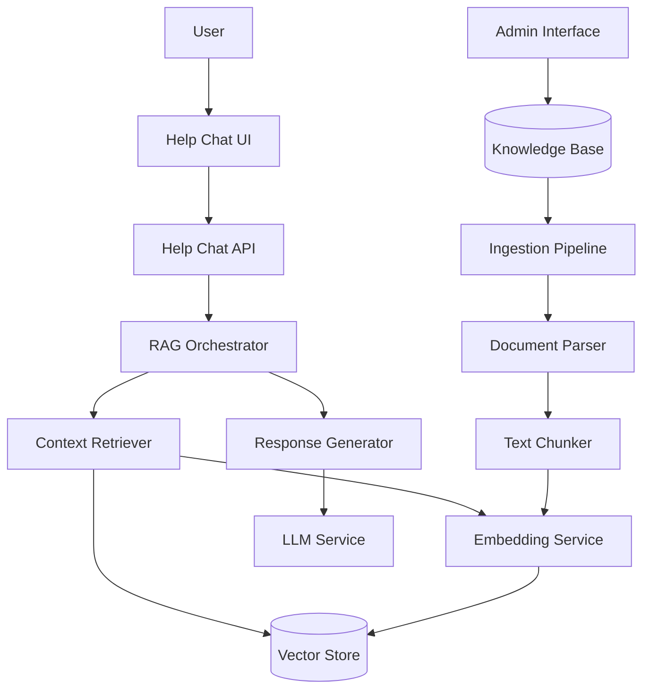

# Design Document: AI Help Chat Knowledge Base

## Overview

This design implements a Retrieval-Augmented Generation (RAG) system to enhance the existing AI help chat with comprehensive knowledge about all PPM application functionality. The system will:

1. Store structured documentation in a knowledge base
2. Convert documentation into vector embeddings for semantic search
3. Retrieve relevant context based on user queries
4. Generate accurate, grounded responses using retrieved information
5. Support multi-language queries and responses
6. Integrate seamlessly with the existing help chat interface

The architecture follows a modular design with clear separation between ingestion, retrieval, and generation components, enabling independent scaling and maintenance.

## Architecture

### High-Level Architecture



### Component Architecture

The system consists of four main subsystems:

1. **Knowledge Management Subsystem**: Handles CRUD operations for documentation
2. **Ingestion Subsystem**: Processes and indexes documentation
3. **Retrieval Subsystem**: Finds relevant context for queries
4. **Generation Subsystem**: Produces natural language responses

### Technology Stack

- **Vector Store**: Pinecone or PostgreSQL with pgvector extension
- **Embedding Model**: OpenAI text-embedding-3-small or sentence-transformers
- **LLM**: OpenAI GPT-4 or GPT-3.5-turbo
- **Backend**: Python (FastAPI) - extends existing `backend/routers/help_chat.py`
- **Frontend**: React/TypeScript - extends existing `components/HelpChat.tsx`
- **Translation**: OpenAI GPT models or dedicated translation service

## Components and Interfaces

### 1. Knowledge Base Storage

**Purpose**: Persistent storage for documentation with metadata and versioning.

**Data Model**:

```typescript
interface KnowledgeDocument {
  id: string;
  title: string;
  content: string;
  category: FeatureCategory;
  keywords: string[];
  metadata: {
    version: string;
    lastUpdated: Date;
    author: string;
    relatedFeatures: string[];
  };
  accessControl: {
    requiredRoles: UserRole[];
    isPublic: boolean;
  };
}

enum FeatureCategory {
  DASHBOARD = "dashboard",
  RESOURCE_MANAGEMENT = "resource_management",
  FINANCIAL_TRACKING = "financial_tracking",
  RISK_MANAGEMENT = "risk_management",
  MONTE_CARLO = "monte_carlo",
  PMR = "pmr",
  CHANGE_MANAGEMENT = "change_management",
  SCHEDULE_MANAGEMENT = "schedule_management",
  AI_FEATURES = "ai_features",
  COLLABORATION = "collaboration",
  AUDIT_TRAILS = "audit_trails",
  USER_MANAGEMENT = "user_management",
  GENERAL = "general"
}
```

**Storage Implementation**:
- Primary storage: PostgreSQL table `knowledge_documents`
- Indexes on: `category`, `keywords`, `lastUpdated`
- Full-text search capability on `content` and `title`

### 2. Document Ingestion Pipeline

**Purpose**: Process raw documentation into searchable chunks with embeddings.

**Components**:

```python
class DocumentParser:
    """Parses various document formats into structured text."""
    
    def parse_markdown(self, content: str) -> ParsedDocument:
        """Extract text, headings, and structure from Markdown."""
        pass
    
    def parse_json(self, content: str) -> ParsedDocument:
        """Extract structured information from JSON documentation."""
        pass
    
    def extract_metadata(self, content: str) -> DocumentMetadata:
        """Extract title, category, keywords from content."""
        pass

class TextChunker:
    """Splits documents into optimal chunks for embedding."""
    
    def __init__(self, chunk_size: int = 512, overlap: int = 50):
        self.chunk_size = chunk_size
        self.overlap = overlap
    
    def chunk_by_tokens(self, text: str) -> List[Chunk]:
        """Split text into chunks by token count with overlap."""
        pass
    
    def chunk_by_semantic_boundaries(self, text: str) -> List[Chunk]:
        """Split text at natural boundaries (paragraphs, sections)."""
        pass

class EmbeddingService:
    """Generates vector embeddings for text."""
    
    def embed_text(self, text: str) -> List[float]:
        """Generate embedding vector for a single text."""
        pass
    
    def embed_batch(self, texts: List[str]) -> List[List[float]]:
        """Generate embeddings for multiple texts efficiently."""
        pass

class IngestionOrchestrator:
    """Coordinates the ingestion pipeline."""
    
    def ingest_document(self, doc: KnowledgeDocument) -> IngestionResult:
        """
        Full ingestion pipeline:
        1. Parse document
        2. Chunk text
        3. Generate embeddings
        4. Store in vector database
        """
        pass
```

**Chunking Strategy**:
- Target chunk size: 512 tokens (~400 words)
- Overlap: 50 tokens to preserve context
- Preserve semantic boundaries (don't split mid-sentence)
- Include document metadata in each chunk

### 3. Vector Store

**Purpose**: Efficient storage and similarity search for embeddings.

**Schema**:

```python
class VectorChunk:
    """Represents a chunk stored in the vector database."""
    id: str
    document_id: str
    chunk_index: int
    content: str
    embedding: List[float]  # 1536 dimensions for OpenAI embeddings
    metadata: {
        "document_title": str,
        "category": str,
        "keywords": List[str],
        "section": str
    }
```

**Operations**:

```python
class VectorStore:
    """Interface for vector database operations."""
    
    def upsert_chunks(self, chunks: List[VectorChunk]) -> None:
        """Insert or update chunks in the vector store."""
        pass
    
    def similarity_search(
        self, 
        query_embedding: List[float], 
        top_k: int = 5,
        filter_metadata: Dict = None
    ) -> List[SearchResult]:
        """Find most similar chunks to query embedding."""
        pass
    
    def delete_by_document_id(self, document_id: str) -> None:
        """Remove all chunks for a document."""
        pass
```

**Implementation Options**:
- **Option A**: Pinecone (managed, scalable, optimized for similarity search)
- **Option B**: PostgreSQL with pgvector (self-hosted, integrated with existing DB)

Recommendation: Start with pgvector for simplicity, migrate to Pinecone if scale demands it.

### 4. Context Retriever

**Purpose**: Find relevant documentation chunks for user queries.

**Implementation**:

```python
class ContextRetriever:
    """Retrieves relevant context for user queries."""
    
    def __init__(
        self,
        embedding_service: EmbeddingService,
        vector_store: VectorStore,
        translator: TranslationService
    ):
        self.embedding_service = embedding_service
        self.vector_store = vector_store
        self.translator = translator
    
    def retrieve(
        self,
        query: str,
        user_context: UserContext,
        top_k: int = 5
    ) -> RetrievalResult:
        """
        Retrieve relevant context for a query.
        
        Steps:
        1. Translate query to English if needed
        2. Generate query embedding
        3. Apply contextual filters (user role, current page)
        4. Perform similarity search
        5. Re-rank results by relevance
        6. Return top-k chunks with metadata
        """
        pass
    
    def _apply_contextual_boost(
        self,
        results: List[SearchResult],
        user_context: UserContext
    ) -> List[SearchResult]:
        """Boost relevance scores based on user context."""
        pass
```

**Contextual Boosting**:
- If user is on a specific feature page, boost chunks from that category by 20%
- If user has a specific role, prioritize role-relevant documentation
- Consider conversation history for multi-turn coherence

### 5. Response Generator

**Purpose**: Generate natural language responses using retrieved context.

**Implementation**:

```python
class ResponseGenerator:
    """Generates responses using RAG approach."""
    
    def __init__(
        self,
        llm_service: LLMService,
        translator: TranslationService
    ):
        self.llm_service = llm_service
        self.translator = translator
    
    def generate_response(
        self,
        query: str,
        retrieved_context: RetrievalResult,
        conversation_history: List[Message],
        user_language: str
    ) -> Response:
        """
        Generate a response using RAG.
        
        Steps:
        1. Construct prompt with system instructions
        2. Include retrieved context
        3. Add conversation history
        4. Generate response via LLM
        5. Translate to user language if needed
        6. Add citations
        """
        pass
    
    def _construct_prompt(
        self,
        query: str,
        context: RetrievalResult,
        history: List[Message]
    ) -> str:
        """Build the prompt for the LLM."""
        pass
```

**Prompt Template**:

```
You are a helpful assistant for a Project Portfolio Management application.
Answer the user's question based ONLY on the provided context.
If the context doesn't contain enough information, acknowledge this limitation.

Context:
{retrieved_chunks}

Conversation History:
{previous_messages}

User Question: {query}

Instructions:
- Answer based on the provided context
- Cite which features you're referencing
- If uncertain, say so
- Be concise but complete
- Use the user's terminology
```

### 6. RAG Orchestrator

**Purpose**: Coordinate the retrieval and generation pipeline.

**Implementation**:

```python
class RAGOrchestrator:
    """Orchestrates the RAG pipeline."""
    
    def __init__(
        self,
        retriever: ContextRetriever,
        generator: ResponseGenerator,
        cache: ResponseCache
    ):
        self.retriever = retriever
        self.generator = generator
        self.cache = cache
    
    async def process_query(
        self,
        query: str,
        user_context: UserContext,
        conversation_history: List[Message]
    ) -> ChatResponse:
        """
        Process a user query through the RAG pipeline.
        
        Steps:
        1. Check cache for similar recent queries
        2. Retrieve relevant context
        3. Generate response
        4. Log query and response
        5. Cache result
        """
        
        # Check cache
        cached = await self.cache.get(query, user_context)
        if cached:
            return cached
        
        # Retrieve context
        context = await self.retriever.retrieve(
            query, 
            user_context,
            top_k=5
        )
        
        # Generate response
        response = await self.generator.generate_response(
            query,
            context,
            conversation_history,
            user_context.language
        )
        
        # Cache and log
        await self.cache.set(query, user_context, response)
        await self._log_interaction(query, context, response)
        
        return response
```

### 7. API Integration

**Purpose**: Extend existing help chat API with RAG capabilities.

**Endpoint Extension** (`backend/routers/help_chat.py`):

```python
@router.post("/chat/message")
async def send_message(
    message: ChatMessage,
    user: User = Depends(get_current_user),
    db: Session = Depends(get_db)
):
    """
    Enhanced endpoint with RAG support.
    Falls back to non-RAG if RAG system unavailable.
    """
    
    user_context = UserContext(
        user_id=user.id,
        role=user.role,
        language=user.preferred_language,
        current_page=message.context.page
    )
    
    try:
        # Try RAG-enhanced response
        if settings.RAG_ENABLED:
            rag_orchestrator = get_rag_orchestrator()
            response = await rag_orchestrator.process_query(
                query=message.content,
                user_context=user_context,
                conversation_history=get_conversation_history(user.id)
            )
            return response
    except Exception as e:
        logger.error(f"RAG system error: {e}")
        # Fall back to previous behavior
    
    # Fallback: existing help chat logic
    return await generate_basic_response(message, user)
```

### 8. Admin Interface for Knowledge Management

**Purpose**: Allow administrators to manage knowledge base content.

**Features**:
- Create/edit/delete knowledge documents
- Preview how documents will be chunked
- Trigger re-indexing
- View usage analytics
- Identify documentation gaps

**API Endpoints**:

```python
@router.post("/admin/knowledge/documents")
async def create_document(doc: KnowledgeDocument, admin: User = Depends(require_admin)):
    """Create a new knowledge document."""
    pass

@router.put("/admin/knowledge/documents/{doc_id}")
async def update_document(doc_id: str, doc: KnowledgeDocument, admin: User = Depends(require_admin)):
    """Update an existing document and re-index."""
    pass

@router.delete("/admin/knowledge/documents/{doc_id}")
async def delete_document(doc_id: str, admin: User = Depends(require_admin)):
    """Delete a document and remove from vector store."""
    pass

@router.get("/admin/knowledge/analytics")
async def get_analytics(admin: User = Depends(require_admin)):
    """Get usage analytics and quality metrics."""
    pass
```

## Data Models

### Core Data Structures

```typescript
// Frontend types (lib/types/help-chat.ts)

interface ChatMessage {
  id: string;
  content: string;
  role: 'user' | 'assistant';
  timestamp: Date;
  citations?: Citation[];
  feedback?: 'helpful' | 'not_helpful';
}

interface Citation {
  documentTitle: string;
  category: string;
  relevanceScore: number;
}

interface UserContext {
  userId: string;
  role: UserRole;
  language: string;
  currentPage?: string;
  currentFeature?: string;
}

interface ChatResponse {
  message: string;
  citations: Citation[];
  confidence: number;
  processingTime: number;
}
```

```python
# Backend models (backend/models/knowledge.py)

from sqlalchemy import Column, String, Text, JSON, DateTime, Enum
from sqlalchemy.dialects.postgresql import ARRAY

class KnowledgeDocument(Base):
    __tablename__ = "knowledge_documents"
    
    id = Column(String, primary_key=True)
    title = Column(String, nullable=False)
    content = Column(Text, nullable=False)
    category = Column(Enum(FeatureCategory), nullable=False)
    keywords = Column(ARRAY(String))
    metadata = Column(JSON)
    access_control = Column(JSON)
    created_at = Column(DateTime)
    updated_at = Column(DateTime)
    version = Column(String)

class QueryLog(Base):
    __tablename__ = "query_logs"
    
    id = Column(String, primary_key=True)
    user_id = Column(String)
    query = Column(Text)
    retrieved_chunks = Column(JSON)
    response = Column(Text)
    feedback = Column(String)
    processing_time = Column(Float)
    timestamp = Column(DateTime)
```

### Vector Store Schema

```python
# For pgvector implementation

CREATE TABLE vector_chunks (
    id TEXT PRIMARY KEY,
    document_id TEXT NOT NULL,
    chunk_index INTEGER NOT NULL,
    content TEXT NOT NULL,
    embedding vector(1536),  -- OpenAI embedding dimension
    metadata JSONB,
    created_at TIMESTAMP DEFAULT NOW(),
    FOREIGN KEY (document_id) REFERENCES knowledge_documents(id) ON DELETE CASCADE
);

CREATE INDEX ON vector_chunks USING ivfflat (embedding vector_cosine_ops);
CREATE INDEX ON vector_chunks (document_id);
CREATE INDEX ON vector_chunks USING gin (metadata);
```

## Correctness Properties

*A property is a characteristic or behavior that should hold true across all valid executions of a system—essentially, a formal statement about what the system should do. Properties serve as the bridge between human-readable specifications and machine-verifiable correctness guarantees.*


### Property 1: Document Metadata Completeness
*For any* Knowledge_Document created in the system, it must contain all required metadata fields (category, keywords, lastUpdated, version) with non-null values.

**Validates: Requirements 1.2**

### Property 2: Valid Category Assignment
*For any* Knowledge_Document stored in the Knowledge_Base, its category must be one of the defined FeatureCategory enum values.

**Validates: Requirements 1.3**

### Property 3: Version Tracking on Updates
*For any* Knowledge_Document that is updated, the version field must change and the previous version must be preserved in history.

**Validates: Requirements 1.4**

### Property 4: Document Chunkability
*For any* Knowledge_Document stored in the system, it must be successfully parseable and chunkable by the Ingestion_Service without errors.

**Validates: Requirements 1.5**

### Property 5: Multi-Format Parsing
*For any* valid document in supported formats (Markdown, plain text, JSON), the Ingestion_Service must successfully parse and extract text content.

**Validates: Requirements 2.1**

### Property 6: Chunk Size and Overlap Constraints
*For any* Knowledge_Document ingested, all generated Chunks must have token counts between 200-1000, and adjacent Chunks must contain overlapping content.

**Validates: Requirements 2.2, 2.3**

### Property 7: Embedding Generation Consistency
*For any* text input (query or chunk), the Embedding_Service must generate a vector embedding with the correct dimensionality (1536 for OpenAI embeddings).

**Validates: Requirements 2.4, 3.1**

### Property 8: Ingestion Round-Trip Integrity
*For any* Knowledge_Document ingested, all its chunks must be retrievable from the Vector_Store with correct references back to the source document ID.

**Validates: Requirements 2.5**

### Property 9: Search Result Count
*For any* query with top_k parameter N, the Context_Retriever must return exactly N results (or fewer if insufficient chunks exist in the knowledge base).

**Validates: Requirements 3.3**

### Property 10: Retrieved Chunk Completeness
*For any* chunk retrieved by semantic search, it must include a similarity score, content, and complete source metadata (document title, category, keywords).

**Validates: Requirements 3.4**

### Property 11: Non-English Query Translation
*For any* user query in a supported non-English language, the Context_Retriever must translate it to English before generating embeddings and performing retrieval.

**Validates: Requirements 3.5**

### Property 12: Response Prompt Construction
*For any* query with retrieved chunks, the Response_Generator must construct a prompt that contains both the user query and the retrieved context.

**Validates: Requirements 4.1**

### Property 13: Citation Inclusion
*For any* response generated with retrieved context, the response must include citations referencing the source documents or features.

**Validates: Requirements 4.4**

### Property 14: Response Language Matching
*For any* user with a non-English interface language, the Response_Generator must return responses in that user's language.

**Validates: Requirements 4.5, 6.2**

### Property 15: Update Propagation to Vector Store
*For any* Knowledge_Document that is updated, all associated chunks in the Vector_Store must be regenerated with new embeddings.

**Validates: Requirements 5.2**

### Property 16: Cascade Deletion
*For any* Knowledge_Document that is deleted, all its associated chunks and embeddings must be removed from the Vector_Store.

**Validates: Requirements 5.3**

### Property 17: Usage Metrics Tracking
*For any* query that retrieves chunks from specific Knowledge_Documents, usage metrics must be recorded for those documents.

**Validates: Requirements 5.5**

### Property 18: Technical Term Preservation
*For any* translation of queries or responses, technical terminology and feature names from a predefined list must remain unchanged or be properly translated according to a terminology dictionary.

**Validates: Requirements 6.3**

### Property 19: Uncertain Translation Handling
*For any* translation where confidence is below a threshold, the response must include the English term in parentheses alongside the translation.

**Validates: Requirements 6.5**

### Property 20: Contextual Ranking Boost
*For any* query where the user is viewing a specific feature page, retrieved chunks from that feature's category must have higher relevance scores than equivalent chunks from other categories.

**Validates: Requirements 7.1**

### Property 21: Role-Based Access Control
*For any* user with specific role permissions, the Context_Retriever must only return chunks from Knowledge_Documents that the user's role is authorized to access.

**Validates: Requirements 7.2, 11.1**

### Property 22: Conversation State Persistence
*For any* multi-turn conversation, the system must store and retrieve conversation history correctly, maintaining message order and content.

**Validates: Requirements 7.5**

### Property 23: Response Time Performance
*For any* set of 100 random queries, at least 95 must receive responses within 3 seconds.

**Validates: Requirements 8.1**

### Property 24: Cache Performance Improvement
*For any* query that is repeated, the second request must have a lower response time than the first request (demonstrating cache effectiveness).

**Validates: Requirements 8.4**

### Property 25: Embedding Batch Processing
*For any* set of multiple texts submitted for embedding, the Embedding_Service must process them as a batch rather than individual sequential requests.

**Validates: Requirements 8.5**

### Property 26: Complete Audit Logging
*For any* query processed through the RAG system, a log entry must exist containing the query text, retrieved chunks, generated response, and timestamp.

**Validates: Requirements 9.1**

### Property 27: Feedback Tracking and Flagging
*For any* response that receives negative user feedback, the system must store the feedback and set a review flag in the database.

**Validates: Requirements 9.2, 9.3**

### Property 28: Graceful Fallback
*For any* query when the RAG system is unavailable or throws an error, the Help_Chat must fall back to the previous non-RAG behavior and still return a response.

**Validates: Requirements 10.2**

### Property 29: Sensitive Information Filtering
*For any* generated response, it must not contain patterns matching sensitive information types (API keys, passwords, internal URLs, database credentials).

**Validates: Requirements 11.2**

### Property 30: PII Anonymization in Logs
*For any* conversation log entry, personally identifiable information (email addresses, names, phone numbers) must be anonymized or encrypted.

**Validates: Requirements 11.3**

### Property 31: Rate Limiting Enforcement
*For any* user making requests, if they exceed the configured rate limit (e.g., 60 requests per minute), subsequent requests must be throttled or rejected with appropriate error codes.

**Validates: Requirements 11.4**

### Property 32: Document Access Restrictions
*For any* Knowledge_Document marked as restricted to specific roles, it must only be retrievable by users with those roles.

**Validates: Requirements 11.5**

### Property 33: Auto-Categorization on Import
*For any* document imported through the import tool, the system must automatically assign a category based on detected feature keywords in the content.

**Validates: Requirements 12.2**

## Error Handling

### Error Categories and Handling Strategies

**1. Ingestion Errors**
- **Invalid document format**: Return detailed error message, skip document, continue processing others
- **Chunking failure**: Log error with document ID, alert admin, mark document as failed
- **Embedding service unavailable**: Retry with exponential backoff (3 attempts), queue for later processing
- **Vector store write failure**: Rollback transaction, retry, alert if persistent

**2. Retrieval Errors**
- **Empty query**: Return helpful message asking user to provide more details
- **Embedding service timeout**: Use cached embeddings if available, otherwise return error with retry option
- **Vector store unavailable**: Fall back to keyword search on document titles/content
- **No results found**: Return message suggesting query reformulation, show popular topics

**3. Generation Errors**
- **LLM service unavailable**: Return cached response if query is similar to recent queries, otherwise show error
- **Context too large**: Truncate context intelligently (keep highest relevance chunks), proceed with generation
- **Translation service failure**: Return response in English with apology message
- **Rate limit exceeded**: Queue request or return error with retry-after time

**4. Access Control Errors**
- **Unauthorized document access**: Filter out restricted documents silently, proceed with authorized results
- **Invalid user context**: Log warning, proceed with default permissions (most restrictive)

**5. Data Consistency Errors**
- **Orphaned chunks**: Background job to identify and clean up chunks without parent documents
- **Missing embeddings**: Re-index affected documents automatically
- **Version mismatch**: Use latest version, log warning for investigation

### Error Response Format

```typescript
interface ErrorResponse {
  error: {
    code: string;
    message: string;
    details?: any;
    retryable: boolean;
    fallbackAvailable: boolean;
  };
  fallbackResponse?: ChatResponse;
}
```

### Monitoring and Alerting

- Alert on error rate > 5% over 5-minute window
- Alert on average response time > 5 seconds
- Alert on embedding service failures > 3 consecutive
- Alert on vector store unavailability
- Daily report on failed ingestions requiring manual review

## Testing Strategy

### Dual Testing Approach

This system requires both **unit tests** and **property-based tests** for comprehensive coverage:

- **Unit tests**: Verify specific examples, edge cases, integration points, and error conditions
- **Property-based tests**: Verify universal properties across randomized inputs (minimum 100 iterations per test)

### Unit Testing Focus Areas

**1. Component Integration Tests**
- Test RAG orchestrator coordinates retriever and generator correctly
- Test API endpoint integration with existing help chat
- Test fallback behavior when RAG unavailable
- Test admin interface CRUD operations

**2. Edge Cases**
- Empty knowledge base (no documents)
- Single-word queries
- Very long queries (>1000 tokens)
- Queries in unsupported languages
- Documents with no chunkable content
- Malformed document formats

**3. Error Conditions**
- Embedding service timeout
- Vector store connection failure
- LLM service rate limiting
- Invalid user permissions
- Concurrent document updates

**4. Specific Examples**
- Query: "How do I create a new project?" → Should retrieve dashboard/project creation docs
- Query: "Monte Carlo simulation setup" → Should retrieve Monte Carlo feature docs
- Query in Spanish: "¿Cómo gestiono recursos?" → Should translate, retrieve, and respond in Spanish

### Property-Based Testing Configuration

**Library**: Use `hypothesis` (Python) for backend property tests

**Configuration**: Each property test must run minimum 100 iterations with randomized inputs

**Tagging**: Each test must reference its design property:
```python
# Feature: ai-help-chat-knowledge-base, Property 1: Document Metadata Completeness
@given(knowledge_document=knowledge_document_strategy())
def test_document_metadata_completeness(knowledge_document):
    # Test implementation
```

### Property Test Implementation Guide

**Property 1-5: Knowledge Base Properties**
- Generate random KnowledgeDocuments with various content
- Test metadata completeness, category validity, versioning, chunkability
- Verify documents can be stored and retrieved correctly

**Property 6-8: Ingestion Properties**
- Generate random documents in different formats
- Test chunking produces correct sizes with overlap
- Test embeddings have correct dimensions
- Test round-trip: ingest → retrieve from vector store

**Property 9-14: Retrieval Properties**
- Generate random queries in various languages
- Test result counts match requested top_k
- Test retrieved chunks have complete metadata
- Test translation occurs for non-English queries
- Test prompts contain query and context

**Property 15-17: Maintenance Properties**
- Generate random document updates and deletions
- Test vector store stays synchronized
- Test usage metrics are recorded

**Property 18-22: Multi-language and Context Properties**
- Generate queries with various user contexts
- Test translations preserve technical terms
- Test contextual ranking boosts work correctly
- Test role-based filtering

**Property 23-25: Performance Properties**
- Generate batches of random queries
- Measure response times (95th percentile < 3s)
- Test caching improves performance
- Test batch embedding processing

**Property 26-33: Security and Logging Properties**
- Generate queries and verify complete logging
- Test feedback tracking and flagging
- Test PII anonymization in logs
- Test rate limiting enforcement
- Test access control restrictions

### Test Data Strategies

**Document Generation Strategy**:
```python
from hypothesis import strategies as st

@st.composite
def knowledge_document_strategy(draw):
    return KnowledgeDocument(
        id=draw(st.uuids()),
        title=draw(st.text(min_size=10, max_size=100)),
        content=draw(st.text(min_size=100, max_size=5000)),
        category=draw(st.sampled_from(FeatureCategory)),
        keywords=draw(st.lists(st.text(min_size=3, max_size=20), min_size=1, max_size=10)),
        metadata={
            "version": draw(st.text(min_size=1, max_size=10)),
            "lastUpdated": draw(st.datetimes()),
            "author": draw(st.text(min_size=5, max_size=50))
        }
    )
```

**Query Generation Strategy**:
```python
@st.composite
def user_query_strategy(draw):
    language = draw(st.sampled_from(['en', 'es', 'fr', 'de', 'it', 'pt', 'nl', 'pl', 'ru', 'zh', 'ja', 'ko']))
    query_text = draw(st.text(min_size=5, max_size=200))
    return UserQuery(
        text=query_text,
        language=language,
        context=draw(user_context_strategy())
    )
```

### Integration Testing

**End-to-End Scenarios**:
1. User asks question → Context retrieved → Response generated → Citations included
2. Admin creates document → Document ingested → Chunks created → Embeddings stored → Searchable
3. Admin updates document → Old chunks removed → New chunks created → Search returns updated content
4. User in Spanish asks question → Query translated → Context retrieved → Response translated back
5. RAG system fails → Fallback to basic help chat → User still gets response

### Performance Testing

**Load Testing**:
- Simulate 100 concurrent users
- Each user sends 10 queries
- Measure: response times, error rates, throughput
- Target: 95% of queries < 3s, error rate < 1%

**Scalability Testing**:
- Test with knowledge bases of varying sizes: 100, 1000, 10000 documents
- Measure: ingestion time, search latency, memory usage
- Verify: performance degrades gracefully with scale

### Manual Testing Checklist

- [ ] Verify responses are accurate for each major feature category
- [ ] Test multi-turn conversations maintain context
- [ ] Verify citations link to correct documentation
- [ ] Test all 11 supported languages
- [ ] Verify UI integration looks correct
- [ ] Test admin interface usability
- [ ] Verify fallback behavior when RAG disabled

## Implementation Notes

### Phase 1: Core Infrastructure (Week 1-2)
- Set up vector store (pgvector)
- Implement embedding service integration
- Create knowledge base schema and models
- Build document ingestion pipeline

### Phase 2: Retrieval System (Week 2-3)
- Implement context retriever
- Build semantic search functionality
- Add contextual ranking
- Implement caching layer

### Phase 3: Generation System (Week 3-4)
- Implement response generator
- Build RAG orchestrator
- Add multi-language support
- Implement citation generation

### Phase 4: Integration (Week 4-5)
- Integrate with existing help chat API
- Update frontend components
- Implement fallback logic
- Add configuration options

### Phase 5: Admin Tools (Week 5-6)
- Build admin interface for knowledge management
- Implement import tooling
- Add analytics dashboard
- Create documentation validation tools

### Phase 6: Testing & Optimization (Week 6-7)
- Write property-based tests
- Conduct performance testing
- Optimize slow queries
- Load test with realistic traffic

### Phase 7: Initial Content & Launch (Week 7-8)
- Import existing documentation
- Create knowledge documents for all features
- Validate coverage completeness
- Soft launch with beta users
- Gather feedback and iterate

### Deployment Considerations

**Environment Variables**:
```bash
# RAG System Configuration
RAG_ENABLED=true
VECTOR_STORE_TYPE=pgvector  # or pinecone
EMBEDDING_MODEL=text-embedding-3-small
EMBEDDING_DIMENSIONS=1536
LLM_MODEL=gpt-4-turbo-preview
MAX_CONTEXT_CHUNKS=5
CHUNK_SIZE=512
CHUNK_OVERLAP=50

# Performance
RESPONSE_CACHE_TTL=3600
RATE_LIMIT_PER_MINUTE=60
MAX_CONCURRENT_REQUESTS=100

# Vector Store (pgvector)
VECTOR_DB_HOST=localhost
VECTOR_DB_PORT=5432
VECTOR_DB_NAME=ppm_vectors

# Vector Store (Pinecone alternative)
PINECONE_API_KEY=xxx
PINECONE_ENVIRONMENT=us-west1-gcp
PINECONE_INDEX_NAME=help-chat-knowledge

# OpenAI
OPENAI_API_KEY=xxx
OPENAI_ORG_ID=xxx

# Monitoring
LOG_LEVEL=INFO
ENABLE_QUERY_LOGGING=true
ENABLE_PERFORMANCE_METRICS=true
```

**Database Migrations**:
- Add `knowledge_documents` table
- Add `vector_chunks` table with pgvector extension
- Add `query_logs` table
- Add indexes for performance

**Monitoring Dashboards**:
- Query volume and response times
- Error rates by error type
- Cache hit rates
- Most queried topics
- Documentation coverage gaps
- User feedback trends

### Future Enhancements

**Phase 2 Features** (Post-Launch):
- Conversational follow-up suggestions
- Proactive help based on user behavior
- Integration with in-app tutorials
- Video/screenshot embedding in responses
- Community-contributed documentation
- A/B testing different retrieval strategies
- Fine-tuned embedding model on domain data
- Hybrid search (semantic + keyword)
- Query intent classification
- Automated documentation generation from code
