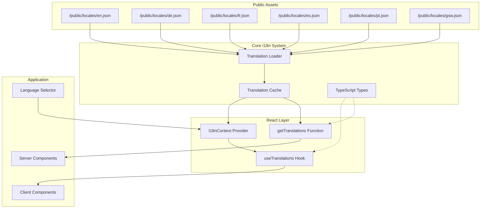
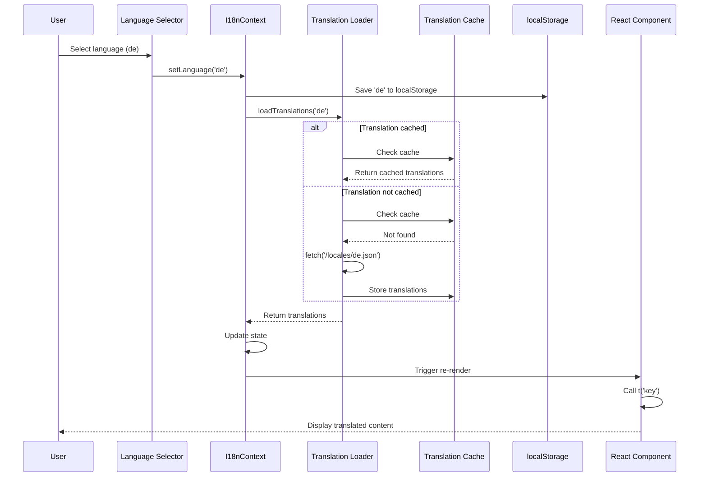

# Design Document: Complete I18n System

## Overview

This design specifies a comprehensive internationalization (i18n) system for the ORKA PPM application built on Next.js 16 with TypeScript. The system replaces the current inline translation approach with a scalable architecture featuring:

- **Separate JSON translation files** per language stored in `/public/locales/`
- **Lazy loading** with in-memory caching to optimize performance
- **TypeScript-first** design with full type safety and autocomplete
- **React Context** for state management across Server and Client Components
- **Backward compatibility** with existing `useLanguage` hook
- **Zero-config** for developers - simple `t('key')` function with automatic fallbacks

The architecture follows [Next.js App Router i18n patterns](https://nextjs.org/docs/app/building-your-application/routing/internationalization) while avoiding the complexity of full routing-based solutions. Instead, it provides a lightweight, context-based approach suitable for applications that don't require URL-based locale routing.

### Key Design Decisions

1. **JSON over TypeScript files**: Enables non-developers to edit translations and supports tooling
2. **Context over URL routing**: Simpler for single-domain applications without locale-specific URLs
3. **Lazy loading**: Only load the active language to minimize bundle size
4. **Dual API**: Separate functions for Server Components (`getTranslations`) and Client Components (`useTranslations`)
5. **Gradual migration**: New system coexists with old translation system during transition

## Architecture

### High-Level Architecture



### Component Interaction Flow



### Data Flow

1. **Initialization**:
   - App starts → I18nProvider reads localStorage for saved language
   - If no saved language → detect browser language
   - Load translation file for selected language
   - Cache translations in memory

2. **Translation Lookup**:
   - Component calls `t('dashboard.title')`
   - System splits key by dots: `['dashboard', 'title']`
   - Navigate nested JSON structure
   - If found → return translation
   - If not found → try English fallback
   - If still not found → return key itself

3. **Language Switch**:
   - User selects new language
   - Check if language is cached
   - If cached → update context immediately
   - If not cached → fetch JSON, cache, then update context
   - All components using `useTranslations` re-render

## Components and Interfaces

### 1. Translation Loader (`lib/i18n/loader.ts`)

Responsible for fetching and caching translation files.

```typescript
// Translation cache - in-memory storage
const translationCache = new Map<string, TranslationDictionary>();

/**
 * Load translations for a specific language
 * Returns cached version if available, otherwise fetches from server
 */
export async function loadTranslations(
  locale: string
): Promise<TranslationDictionary> {
  // Check cache first
  if (translationCache.has(locale)) {
    return translationCache.get(locale)!;
  }

  try {
    // Fetch from public folder
    const response = await fetch(`/locales/${locale}.json`);
    
    if (!response.ok) {
      throw new Error(`Failed to load translations for ${locale}`);
    }

    const translations = await response.json();
    
    // Validate structure
    if (typeof translations !== 'object' || translations === null) {
      throw new Error(`Invalid translation file format for ${locale}`);
    }

    // Cache the translations
    translationCache.set(locale, translations);
    
    return translations;
  } catch (error) {
    console.error(`Error loading translations for ${locale}:`, error);
    
    // Retry once
    try {
      const response = await fetch(`/locales/${locale}.json`);
      const translations = await response.json();
      translationCache.set(locale, translations);
      return translations;
    } catch (retryError) {
      console.error(`Retry failed for ${locale}:`, retryError);
      
      // If not English, try English fallback
      if (locale !== 'en') {
        console.warn(`Falling back to English for ${locale}`);
        return loadTranslations('en');
      }
      
      // Return empty object as last resort
      return {};
    }
  }
}

/**
 * Preload translations for a language without waiting
 */
export function preloadTranslations(locale: string): void {
  if (!translationCache.has(locale)) {
    loadTranslations(locale).catch(error => {
      console.warn(`Failed to preload ${locale}:`, error);
    });
  }
}

/**
 * Clear cache for a specific language or all languages
 */
export function clearTranslationCache(locale?: string): void {
  if (locale) {
    translationCache.delete(locale);
  } else {
    translationCache.clear();
  }
}

/**
 * Check if a language is cached
 */
export function isLanguageCached(locale: string): boolean {
  return translationCache.has(locale);
}
```

### 2. I18n Context (`lib/i18n/context.tsx`)

Provides language state and translation functions to the component tree.

```typescript
'use client'

import { createContext, useContext, useState, useEffect, useCallback, ReactNode } from 'react';
import { loadTranslations, isLanguageCached } from './loader';
import { TranslationDictionary, TranslationKey } from './types';

interface I18nContextValue {
  locale: string;
  translations: TranslationDictionary;
  isLoading: boolean;
  setLocale: (locale: string) => Promise<void>;
  t: (key: TranslationKey, params?: Record<string, string | number>) => string;
}

const I18nContext = createContext<I18nContextValue | undefined>(undefined);

const SUPPORTED_LOCALES = ['en', 'de', 'fr', 'es', 'pl', 'gsw'] as const;
const DEFAULT_LOCALE = 'en';
const STORAGE_KEY = 'orka-ppm-locale';

/**
 * Detect browser language and map to supported locale
 */
function detectBrowserLanguage(): string {
  if (typeof window === 'undefined') return DEFAULT_LOCALE;
  
  const browserLang = navigator.language.split('-')[0]; // 'en-US' -> 'en'
  
  return SUPPORTED_LOCALES.includes(browserLang as any) 
    ? browserLang 
    : DEFAULT_LOCALE;
}

/**
 * Get saved locale from localStorage
 */
function getSavedLocale(): string | null {
  if (typeof window === 'undefined') return null;
  
  try {
    return localStorage.getItem(STORAGE_KEY);
  } catch {
    return null;
  }
}

/**
 * Save locale to localStorage
 */
function saveLocale(locale: string): void {
  if (typeof window === 'undefined') return;
  
  try {
    localStorage.setItem(STORAGE_KEY, locale);
  } catch (error) {
    console.warn('Failed to save locale to localStorage:', error);
  }
}

export function I18nProvider({ children }: { children: ReactNode }) {
  const [locale, setLocaleState] = useState<string>(() => {
    // Initialize from localStorage or browser detection
    return getSavedLocale() || detectBrowserLanguage();
  });
  
  const [translations, setTranslations] = useState<TranslationDictionary>({});
  const [isLoading, setIsLoading] = useState(true);

  // Load translations when locale changes
  useEffect(() => {
    let cancelled = false;

    async function load() {
      setIsLoading(true);
      
      try {
        const newTranslations = await loadTranslations(locale);
        
        if (!cancelled) {
          setTranslations(newTranslations);
        }
      } catch (error) {
        console.error('Failed to load translations:', error);
      } finally {
        if (!cancelled) {
          setIsLoading(false);
        }
      }
    }

    load();

    return () => {
      cancelled = true;
    };
  }, [locale]);

  const setLocale = useCallback(async (newLocale: string) => {
    if (!SUPPORTED_LOCALES.includes(newLocale as any)) {
      console.warn(`Unsupported locale: ${newLocale}`);
      return;
    }

    // Save to localStorage
    saveLocale(newLocale);

    // If already cached, update immediately
    if (isLanguageCached(newLocale)) {
      setLocaleState(newLocale);
    } else {
      // Show loading state while fetching
      setIsLoading(true);
      setLocaleState(newLocale);
    }
  }, []);

  const t = useCallback((
    key: TranslationKey,
    params?: Record<string, string | number>
  ): string => {
    // Navigate nested object using dot notation
    const keys = key.split('.');
    let value: any = translations;

    for (const k of keys) {
      if (value && typeof value === 'object' && k in value) {
        value = value[k];
      } else {
        // Key not found - log warning in development
        if (process.env.NODE_ENV === 'development') {
          console.warn(`Translation key not found: ${key} (locale: ${locale})`);
        }
        
        // Return the key itself as fallback
        return key;
      }
    }

    // Ensure we got a string
    if (typeof value !== 'string') {
      console.warn(`Translation value is not a string: ${key}`);
      return key;
    }

    // Handle interpolation
    if (params) {
      return Object.entries(params).reduce((str, [paramKey, paramValue]) => {
        return str.replace(new RegExp(`\\{${paramKey}\\}`, 'g'), String(paramValue));
      }, value);
    }

    return value;
  }, [translations, locale]);

  const contextValue: I18nContextValue = {
    locale,
    translations,
    isLoading,
    setLocale,
    t,
  };

  return (
    <I18nContext.Provider value={contextValue}>
      {children}
    </I18nContext.Provider>
  );
}

/**
 * Hook for accessing i18n in client components
 */
export function useI18n() {
  const context = useContext(I18nContext);
  
  if (!context) {
    throw new Error('useI18n must be used within I18nProvider');
  }
  
  return context;
}

/**
 * Convenience hook that returns just the translation function
 */
export function useTranslations() {
  const { t, locale, isLoading } = useI18n();
  return { t, locale, isLoading };
}
```

### 3. Server Component Support (`lib/i18n/server.ts`)

Provides translation function for Server Components.

```typescript
import { cookies } from 'next/headers';
import { loadTranslations } from './loader';
import { TranslationKey, TranslationDictionary } from './types';

const DEFAULT_LOCALE = 'en';

/**
 * Get current locale from cookies (set by client)
 * Server components can't access localStorage, so we sync via cookies
 */
async function getServerLocale(): Promise<string> {
  const cookieStore = await cookies();
  return cookieStore.get('orka-ppm-locale')?.value || DEFAULT_LOCALE;
}

/**
 * Get translations for server components
 * This function can be called in Server Components
 */
export async function getTranslations() {
  const locale = await getServerLocale();
  const translations = await loadTranslations(locale);

  return {
    t: (key: TranslationKey, params?: Record<string, string | number>): string => {
      // Navigate nested object using dot notation
      const keys = key.split('.');
      let value: any = translations;

      for (const k of keys) {
        if (value && typeof value === 'object' && k in value) {
          value = value[k];
        } else {
          // Key not found
          if (process.env.NODE_ENV === 'development') {
            console.warn(`Translation key not found: ${key} (locale: ${locale})`);
          }
          return key;
        }
      }

      if (typeof value !== 'string') {
        console.warn(`Translation value is not a string: ${key}`);
        return key;
      }

      // Handle interpolation
      if (params) {
        return Object.entries(params).reduce((str, [paramKey, paramValue]) => {
          return str.replace(new RegExp(`\\{${paramKey}\\}`, 'g'), String(paramValue));
        }, value);
      }

      return value;
    },
    locale,
  };
}
```

### 4. TypeScript Types (`lib/i18n/types.ts`)

Type definitions for the i18n system.

```typescript
/**
 * Translation dictionary structure
 * Nested object with string leaf values
 */
export type TranslationDictionary = {
  [key: string]: string | TranslationDictionary;
};

/**
 * Supported language codes
 */
export type SupportedLocale = 'en' | 'de' | 'fr' | 'es' | 'pl' | 'gsw';

/**
 * Translation key type
 * Will be generated from actual translation files
 */
export type TranslationKey = string;

/**
 * Interpolation parameters
 */
export type InterpolationParams = Record<string, string | number>;

/**
 * Pluralization rules
 */
export interface PluralRules {
  zero?: string;
  one: string;
  two?: string;
  few?: string;
  many?: string;
  other: string;
}

/**
 * Translation function type
 */
export type TranslationFunction = (
  key: TranslationKey,
  params?: InterpolationParams
) => string;
```

### 5. Locale Formatters (`lib/i18n/formatters.ts`)

Utilities for locale-specific formatting.

```typescript
import { SupportedLocale } from './types';

/**
 * Locale to Intl locale mapping
 */
const LOCALE_MAP: Record<SupportedLocale, string> = {
  en: 'en-US',
  de: 'de-DE',
  fr: 'fr-FR',
  es: 'es-ES',
  pl: 'pl-PL',
  gsw: 'de-CH', // Swiss German uses Swiss formatting
};

/**
 * Format a date according to locale
 */
export function formatDate(
  date: Date,
  locale: SupportedLocale,
  options?: Intl.DateTimeFormatOptions
): string {
  const intlLocale = LOCALE_MAP[locale];
  
  const defaultOptions: Intl.DateTimeFormatOptions = {
    year: 'numeric',
    month: 'long',
    day: 'numeric',
    ...options,
  };

  try {
    return new Intl.DateTimeFormat(intlLocale, defaultOptions).format(date);
  } catch (error) {
    console.error('Date formatting error:', error);
    return date.toLocaleDateString();
  }
}

/**
 * Format a number according to locale
 */
export function formatNumber(
  number: number,
  locale: SupportedLocale,
  options?: Intl.NumberFormatOptions
): string {
  const intlLocale = LOCALE_MAP[locale];

  try {
    return new Intl.NumberFormat(intlLocale, options).format(number);
  } catch (error) {
    console.error('Number formatting error:', error);
    return number.toString();
  }
}

/**
 * Format currency according to locale
 */
export function formatCurrency(
  amount: number,
  locale: SupportedLocale,
  currency: string = 'EUR'
): string {
  const intlLocale = LOCALE_MAP[locale];

  try {
    return new Intl.NumberFormat(intlLocale, {
      style: 'currency',
      currency,
    }).format(amount);
  } catch (error) {
    console.error('Currency formatting error:', error);
    return `${currency} ${amount}`;
  }
}

/**
 * Format relative time (e.g., "2 days ago")
 */
export function formatRelativeTime(
  date: Date,
  locale: SupportedLocale,
  baseDate: Date = new Date()
): string {
  const intlLocale = LOCALE_MAP[locale];
  const diffInSeconds = Math.floor((baseDate.getTime() - date.getTime()) / 1000);

  const units: Array<[Intl.RelativeTimeFormatUnit, number]> = [
    ['year', 31536000],
    ['month', 2592000],
    ['week', 604800],
    ['day', 86400],
    ['hour', 3600],
    ['minute', 60],
    ['second', 1],
  ];

  try {
    const rtf = new Intl.RelativeTimeFormat(intlLocale, { numeric: 'auto' });

    for (const [unit, secondsInUnit] of units) {
      if (Math.abs(diffInSeconds) >= secondsInUnit) {
        const value = Math.floor(diffInSeconds / secondsInUnit);
        return rtf.format(-value, unit);
      }
    }

    return rtf.format(0, 'second');
  } catch (error) {
    console.error('Relative time formatting error:', error);
    return date.toLocaleDateString();
  }
}
```

### 6. Integration with Existing useLanguage Hook

Update the existing hook to sync with the new i18n system.

```typescript
// hooks/useLanguage.ts - Updated version

'use client'

import { useI18n } from '../lib/i18n/context';
import { useCallback } from 'react';

// Map new locale codes to old system if needed
const LOCALE_COMPATIBILITY_MAP: Record<string, string> = {
  'en': 'en',
  'de': 'de',
  'fr': 'fr',
  'es': 'es',
  'pl': 'pl',
  'gsw': 'gsw',
};

/**
 * Backward-compatible language hook
 * Wraps the new i18n system to maintain existing API
 */
export function useLanguage() {
  const { locale, setLocale, isLoading } = useI18n();

  const setLanguage = useCallback(async (language: string): Promise<boolean> => {
    try {
      const mappedLocale = LOCALE_COMPATIBILITY_MAP[language] || language;
      await setLocale(mappedLocale);
      return true;
    } catch (error) {
      console.error('Failed to set language:', error);
      return false;
    }
  }, [setLocale]);

  return {
    currentLanguage: locale,
    setLanguage,
    isLoading,
    // Keep other existing methods for compatibility
    supportedLanguages: [
      { code: 'en', name: 'English', native_name: 'English', formal_tone: false },
      { code: 'de', name: 'German', native_name: 'Deutsch', formal_tone: true },
      { code: 'fr', name: 'French', native_name: 'Français', formal_tone: true },
      { code: 'es', name: 'Spanish', native_name: 'Español', formal_tone: false },
      { code: 'pl', name: 'Polish', native_name: 'Polski', formal_tone: false },
      { code: 'gsw', name: 'Swiss German', native_name: 'Baseldytsch', formal_tone: false },
    ],
    error: null,
  };
}
```

## Data Models

### Translation File Structure

Each language file (`/public/locales/{lang}.json`) follows this nested structure:

```json
{
  "common": {
    "loading": "Loading...",
    "error": "Error",
    "save": "Save",
    "cancel": "Cancel",
    "delete": "Delete",
    "edit": "Edit",
    "add": "Add",
    "search": "Search",
    "filter": "Filter",
    "export": "Export",
    "import": "Import",
    "close": "Close",
    "retry": "Try again"
  },
  "nav": {
    "dashboards": "Dashboards",
    "scenarios": "Scenarios",
    "resources": "Resources",
    "reports": "Reports",
    "financials": "Financials",
    "risks": "Risks",
    "monteCarlo": "Monte Carlo",
    "changes": "Changes",
    "feedback": "Feedback",
    "performance": "Performance",
    "users": "Users",
    "audit": "Audit",
    "more": "More"
  },
  "dashboard": {
    "title": "Portfolio Dashboard",
    "projects": "projects",
    "updated": "Updated",
    "synced": "Synced",
    "syncing": "Syncing...",
    "live": "Live",
    "critical": "Critical",
    "budgetAlert": "Budget Alert",
    "budgetAlerts": "Budget Alerts",
    "aiEnhanced": "AI Enhanced",
    "refresh": "Refresh",
    "traditionalView": "Switch to Traditional View",
    "aiView": "Switch to AI-Enhanced View",
    "fallbackData": "Using fallback data"
  },
  "scenarios": {
    "title": "Scenarios",
    "create": "Create Scenario",
    "edit": "Edit Scenario",
    "delete": "Delete Scenario",
    "compare": "Compare Scenarios",
    "baseline": "Baseline",
    "optimistic": "Optimistic",
    "pessimistic": "Pessimistic",
    "form": {
      "name": "Scenario Name",
      "description": "Description",
      "type": "Scenario Type",
      "startDate": "Start Date",
      "endDate": "End Date"
    }
  },
  "resources": {
    "title": "Resources",
    "allocation": "Resource Allocation",
    "capacity": "Capacity",
    "utilization": "Utilization",
    "availability": "Availability",
    "form": {
      "name": "Resource Name",
      "role": "Role",
      "department": "Department",
      "capacity": "Capacity (%)",
      "cost": "Cost per Hour"
    }
  },
  "financials": {
    "title": "Financials",
    "budget": "Budget",
    "actual": "Actual",
    "forecast": "Forecast",
    "variance": "Variance",
    "costBreakdown": "Cost Breakdown",
    "revenueProjection": "Revenue Projection"
  },
  "risks": {
    "title": "Risks",
    "register": "Risk Register",
    "assessment": "Risk Assessment",
    "mitigation": "Mitigation Plan",
    "probability": "Probability",
    "impact": "Impact",
    "status": "Status",
    "form": {
      "title": "Risk Title",
      "description": "Description",
      "category": "Category",
      "probability": "Probability",
      "impact": "Impact",
      "mitigation": "Mitigation Strategy"
    }
  },
  "reports": {
    "title": "Reports",
    "generate": "Generate Report",
    "export": "Export Report",
    "schedule": "Schedule Report",
    "pmr": "Project Management Report",
    "executive": "Executive Summary",
    "detailed": "Detailed Report"
  },
  "monteCarlo": {
    "title": "Monte Carlo Simulation",
    "run": "Run Simulation",
    "iterations": "Iterations",
    "confidence": "Confidence Level",
    "results": "Results",
    "distribution": "Distribution"
  },
  "changes": {
    "title": "Change Management",
    "request": "Change Request",
    "approve": "Approve",
    "reject": "Reject",
    "pending": "Pending",
    "approved": "Approved",
    "rejected": "Rejected"
  },
  "feedback": {
    "title": "Feedback",
    "submit": "Submit Feedback",
    "category": "Category",
    "priority": "Priority",
    "description": "Description"
  },
  "performance": {
    "title": "Performance",
    "metrics": "Metrics",
    "kpis": "KPIs",
    "trends": "Trends",
    "benchmarks": "Benchmarks"
  },
  "users": {
    "title": "Users",
    "add": "Add User",
    "edit": "Edit User",
    "delete": "Delete User",
    "role": "Role",
    "permissions": "Permissions",
    "active": "Active",
    "inactive": "Inactive"
  },
  "audit": {
    "title": "Audit Log",
    "action": "Action",
    "user": "User",
    "timestamp": "Timestamp",
    "details": "Details",
    "filter": "Filter Logs"
  },
  "errors": {
    "notFound": "Not found",
    "unauthorized": "Unauthorized",
    "serverError": "Server error",
    "networkError": "Network error",
    "validationError": "Validation error",
    "tryAgain": "Please try again"
  },
  "validation": {
    "required": "This field is required",
    "invalidEmail": "Invalid email address",
    "invalidDate": "Invalid date",
    "minLength": "Minimum length is {min} characters",
    "maxLength": "Maximum length is {max} characters",
    "minValue": "Minimum value is {min}",
    "maxValue": "Maximum value is {max}"
  }
}
```

### Key Naming Conventions

1. **Top-level categories**: Feature or page names (`dashboard`, `scenarios`, `resources`)
2. **Common elements**: Shared UI elements under `common.*`
3. **Navigation**: Menu items under `nav.*`
4. **Forms**: Form fields under `{feature}.form.*`
5. **Errors**: Error messages under `errors.*`
6. **Validation**: Validation messages under `validation.*`

### Type Generation Strategy

Generate TypeScript types from the English translation file:

```typescript
// This would be generated automatically
type TranslationKeys = 
  | 'common.loading'
  | 'common.error'
  | 'common.save'
  | 'nav.dashboards'
  | 'nav.scenarios'
  | 'dashboard.title'
  | 'dashboard.projects'
  // ... all other keys
  ;
```


## Correctness Properties

*A property is a characteristic or behavior that should hold true across all valid executions of a system—essentially, a formal statement about what the system should do. Properties serve as the bridge between human-readable specifications and machine-verifiable correctness guarantees.*

### Property Reflection

After analyzing all acceptance criteria, I identified the following redundancies:
- Requirements 5.3 and 10.1 both test fallback to English for missing keys → Combined into Property 2
- Requirements 5.4 and 10.2 both test returning the key when all translations missing → Combined into Property 3
- Requirements 2.3 and 18.3 both test cache prevents redundant requests → Combined into Property 5
- Requirements 1.4 and 19.2 both test handling malformed JSON → Combined into Property 6
- Requirements 2.5 and 19.3 both test retry logic → Combined into Property 7
- Requirements 5.5 and 12.1 both test interpolation support → Combined into Property 8
- Requirements 7.4 and 8.4 both test fallback for unsupported languages → Combined into Property 13

### Core Translation Properties

Property 1: Translation lookup returns correct value
*For any* valid translation key and supported language, calling t(key) should return the translation value from that language's translation file
**Validates: Requirements 5.2**

Property 2: Missing key fallback to English
*For any* translation key that exists in English but not in the selected language, calling t(key) should return the English translation
**Validates: Requirements 5.3, 10.1**

Property 3: Missing key returns key itself
*For any* translation key that doesn't exist in any language file, calling t(key) should return the key string itself
**Validates: Requirements 5.4, 10.2**

Property 4: Console warning for missing translations
*For any* translation key that triggers fallback behavior, the system should log a warning to the console in development mode
**Validates: Requirements 10.3, 16.2**

### Lazy Loading and Caching Properties

Property 5: Cache prevents redundant network requests
*For any* language that has been loaded once, selecting that language again should retrieve translations from cache without making a network request
**Validates: Requirements 2.3, 18.3**

Property 6: Malformed JSON fallback
*For any* translation file that contains invalid JSON, the system should log an error and fall back to loading the English translation file
**Validates: Requirements 1.4, 19.2**

Property 7: Network error retry logic
*For any* translation file fetch that fails due to network error, the system should retry exactly once before falling back to English
**Validates: Requirements 2.5, 19.3**

Property 8: Single language loaded on initialization
*For any* application start, only one translation file (the selected language) should be fetched, not all six languages
**Validates: Requirements 1.2, 2.1**

### Interpolation and Formatting Properties

Property 9: Variable interpolation
*For any* translation containing {variableName} placeholders and matching params object, calling t(key, params) should replace all placeholders with their corresponding values
**Validates: Requirements 5.5, 12.1, 12.2**

Property 10: Multiple variable interpolation
*For any* translation containing multiple {variable} placeholders, all placeholders should be replaced with their corresponding values from the params object
**Validates: Requirements 12.3**

Property 11: Missing variable handling
*For any* translation with {variableName} placeholder where the variable is not provided in params, the placeholder should remain unchanged in the output
**Validates: Requirements 12.4**

Property 12: HTML escaping for XSS prevention
*For any* interpolation parameter containing HTML tags, the HTML should be escaped in the output to prevent XSS attacks
**Validates: Requirements 12.5**

### Language Detection and Persistence Properties

Property 13: Unsupported language fallback
*For any* browser language code that is not in the supported languages list, the system should default to English
**Validates: Requirements 7.4, 8.4**

Property 14: Regional variant normalization
*For any* browser language with regional variant (e.g., 'en-US', 'de-AT'), the system should extract the base language code (e.g., 'en', 'de') and match it to supported languages
**Validates: Requirements 8.3**

Property 15: Language persistence in localStorage
*For any* language selection, the language code should be stored in localStorage and retrieved on subsequent application loads
**Validates: Requirements 7.1, 7.2**

Property 16: Browser language detection on first visit
*For any* first-time application load with no stored language preference, the system should detect and use the browser's language if supported
**Validates: Requirements 8.1, 8.2**

Property 17: Stored preference takes precedence
*For any* application load where localStorage contains a language preference, that preference should be used instead of detecting browser language
**Validates: Requirements 8.5**

### Language Switching Properties

Property 18: No page reload for cached languages
*For any* language switch to a previously loaded language, the UI should update without triggering a full page reload
**Validates: Requirements 9.2**

Property 19: Async load without page reload
*For any* language switch to an uncached language, the translation file should load asynchronously and update the UI without triggering a full page reload
**Validates: Requirements 9.3**

Property 20: Context update triggers re-renders
*For any* language change, the I18nContext should update and trigger re-renders of all components using useTranslations
**Validates: Requirements 9.5**

### Locale Formatting Properties

Property 21: Date formatting per locale
*For any* date and supported locale, formatDate should return a string formatted according to that locale's conventions
**Validates: Requirements 11.1**

Property 22: Number formatting per locale
*For any* number and supported locale, formatNumber should return a string with appropriate thousand separators and decimal points for that locale
**Validates: Requirements 11.2**

Property 23: Currency formatting per locale
*For any* amount, currency code, and supported locale, formatCurrency should return a string with correct currency symbol and position for that locale
**Validates: Requirements 11.3**

Property 24: Relative time formatting per locale
*For any* date and supported locale, formatRelativeTime should return a localized relative time string (e.g., "2 days ago" in English, "vor 2 Tagen" in German)
**Validates: Requirements 11.4**

### Pluralization Properties

Property 25: Plural form selection by count
*For any* translation with plural forms and a count value, the system should select the grammatically correct plural form based on the count and language rules
**Validates: Requirements 13.2**

Property 26: Language-specific plural rules
*For any* language with complex plural rules (e.g., Polish with different forms for 2-4 vs 5+), the system should apply the correct language-specific rules
**Validates: Requirements 13.4**

Property 27: Pluralization with interpolation
*For any* plural translation with {count} placeholder, the system should both select the correct plural form and interpolate the count value
**Validates: Requirements 13.5**

### Cross-Environment Consistency Properties

Property 28: Fallback consistency across environments
*For any* missing translation key, the fallback behavior should be identical in Server Components and Client Components
**Validates: Requirements 10.4**

Property 29: Missing translation detection in both environments
*For any* missing translation, the detection and logging should work consistently in both Server Components and Client Components
**Validates: Requirements 16.4**

Property 30: Language state persistence across navigation
*For any* client-side navigation, the selected language should remain unchanged
**Validates: Requirements 14.5**

### Unicode and Character Support Properties

Property 31: Unicode character preservation
*For any* translation containing Unicode characters (including Swiss German special characters), the characters should be preserved correctly through loading, caching, and rendering
**Validates: Requirements 1.5**

### Development Mode Properties

Property 32: Production mode suppresses warnings
*For any* missing translation in production mode, no console warnings should be displayed
**Validates: Requirements 16.5**

## Error Handling

### Error Categories

1. **Translation File Loading Errors**
   - Network failures (timeout, connection refused)
   - HTTP errors (404, 500)
   - Malformed JSON
   - Missing files

2. **Translation Lookup Errors**
   - Missing keys
   - Invalid key format
   - Type mismatches (expected string, got object)

3. **Interpolation Errors**
   - Missing parameters
   - Invalid parameter types
   - Circular references

4. **Locale Formatting Errors**
   - Invalid dates
   - Invalid numbers
   - Unsupported locales

### Error Handling Strategy

```typescript
// Error handling hierarchy
try {
  // 1. Try to load requested language
  const translations = await loadTranslations(locale);
} catch (primaryError) {
  console.error(`Failed to load ${locale}:`, primaryError);
  
  try {
    // 2. Retry once
    const translations = await loadTranslations(locale);
  } catch (retryError) {
    console.error(`Retry failed for ${locale}:`, retryError);
    
    if (locale !== 'en') {
      // 3. Fall back to English
      console.warn(`Falling back to English`);
      return loadTranslations('en');
    } else {
      // 4. Last resort: empty object
      console.error('All translation loading failed');
      return {};
    }
  }
}
```

### Error Logging

- **Development Mode**: Verbose logging with stack traces
- **Production Mode**: Minimal logging, no user-facing errors
- **Console Warnings**: For missing translations (dev only)
- **Error Boundaries**: Prevent translation errors from crashing the app

### Graceful Degradation

1. **Missing Translation**: Show key or English fallback
2. **Failed Load**: Use cached English or empty translations
3. **Malformed JSON**: Log error, use English
4. **Network Error**: Retry once, then use English
5. **Invalid Interpolation**: Show translation without interpolation

## Testing Strategy

### Dual Testing Approach

The i18n system requires both unit tests and property-based tests for comprehensive coverage:

- **Unit Tests**: Verify specific examples, edge cases, and integration points
- **Property Tests**: Verify universal properties across all inputs

### Unit Testing Focus

Unit tests should cover:

1. **Specific Examples**
   - Loading English translations
   - Switching from English to German
   - Formatting a specific date in French

2. **Edge Cases**
   - Empty translation files
   - Translation files with only one key
   - Keys with special characters
   - Very long translation strings

3. **Integration Points**
   - I18nProvider wrapping components
   - useTranslations hook in components
   - getTranslations in Server Components
   - Integration with existing useLanguage hook

4. **Error Conditions**
   - 404 errors when loading translations
   - Malformed JSON responses
   - Network timeouts
   - Invalid locale codes

### Property-Based Testing Configuration

**Library**: Use `fast-check` for TypeScript/JavaScript property-based testing

**Configuration**:
- Minimum 100 iterations per property test
- Each test tagged with feature name and property number
- Tag format: `// Feature: complete-i18n-system, Property {N}: {property text}`

**Example Property Test Structure**:

```typescript
import fc from 'fast-check';

describe('I18n System Properties', () => {
  // Feature: complete-i18n-system, Property 1: Translation lookup returns correct value
  it('should return correct translation for any valid key and language', () => {
    fc.assert(
      fc.property(
        fc.constantFrom('en', 'de', 'fr', 'es', 'pl', 'gsw'),
        fc.constantFrom('common.save', 'nav.dashboards', 'dashboard.title'),
        async (locale, key) => {
          const translations = await loadTranslations(locale);
          const result = t(key, translations);
          expect(typeof result).toBe('string');
          expect(result.length).toBeGreaterThan(0);
        }
      ),
      { numRuns: 100 }
    );
  });

  // Feature: complete-i18n-system, Property 9: Variable interpolation
  it('should replace all placeholders with corresponding values', () => {
    fc.assert(
      fc.property(
        fc.string(),
        fc.dictionary(fc.string(), fc.oneof(fc.string(), fc.integer())),
        (template, params) => {
          // Create translation with placeholders
          const translation = Object.keys(params)
            .reduce((str, key) => str + ` {${key}}`, template);
          
          const result = interpolate(translation, params);
          
          // Verify all placeholders are replaced
          Object.keys(params).forEach(key => {
            expect(result).toContain(String(params[key]));
            expect(result).not.toContain(`{${key}}`);
          });
        }
      ),
      { numRuns: 100 }
    );
  });
});
```

### Test Coverage Goals

- **Unit Test Coverage**: 80%+ of code lines
- **Property Test Coverage**: All 32 correctness properties
- **Integration Test Coverage**: All major user flows
- **E2E Test Coverage**: Language switching in real browser

### Testing Tools

- **Unit Tests**: Jest + React Testing Library
- **Property Tests**: fast-check
- **Integration Tests**: Jest + React Testing Library
- **E2E Tests**: Playwright or Cypress
- **Type Tests**: tsd for TypeScript type testing

