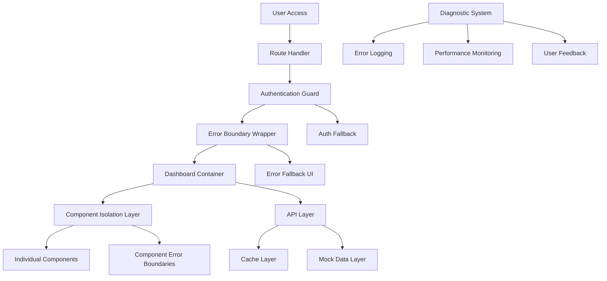
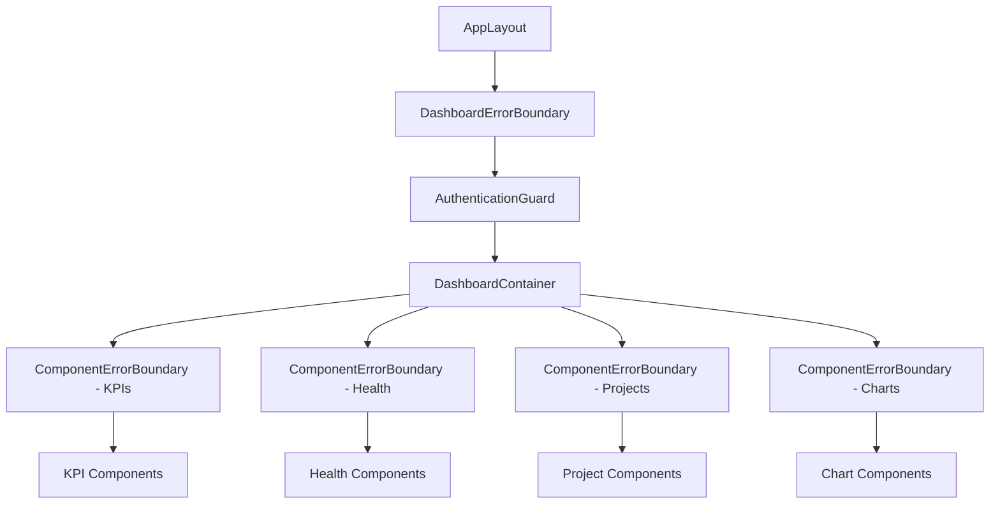

# Design Document

## Overview

This design addresses the white page issue occurring when users access the Portfolio Dashboard. The solution implements a multi-layered approach combining error boundaries, authentication resilience, API failure handling, and comprehensive diagnostics to ensure the dashboard remains functional even when individual components or services fail.

The design follows a defensive programming approach where each layer provides fallback mechanisms, ensuring users always see meaningful content rather than a blank page.

## Architecture

### High-Level Architecture



### Component Hierarchy



## Components and Interfaces

### 1. Error Boundary System

#### DashboardErrorBoundary
```typescript
interface DashboardErrorBoundaryProps {
  children: React.ReactNode
  fallback?: React.ComponentType<ErrorFallbackProps>
  onError?: (error: Error, errorInfo: ErrorInfo) => void
  enableRetry?: boolean
}

interface ErrorFallbackProps {
  error: Error
  resetError: () => void
  errorId: string
}
```

**Responsibilities:**
- Catch all unhandled errors in dashboard components
- Display user-friendly error messages
- Provide retry functionality
- Log errors for debugging
- Prevent white page scenarios

#### ComponentErrorBoundary
```typescript
interface ComponentErrorBoundaryProps {
  children: React.ReactNode
  componentName: string
  fallbackComponent?: React.ComponentType
  isolateErrors?: boolean
}
```

**Responsibilities:**
- Isolate errors to individual components
- Display component-specific error placeholders
- Allow other components to continue functioning
- Provide component-level retry options

### 2. Authentication Resilience System

#### AuthenticationGuard
```typescript
interface AuthenticationGuardProps {
  children: React.ReactNode
  fallbackComponent?: React.ComponentType
  enableGuestMode?: boolean
  retryAttempts?: number
}

interface AuthState {
  isAuthenticated: boolean
  isLoading: boolean
  error: AuthError | null
  retryCount: number
}
```

**Responsibilities:**
- Handle authentication state transitions
- Provide loading states during auth checks
- Implement retry logic for failed auth
- Support graceful degradation for guest users

### 3. API Resilience System

#### ApiClient with Fallback
```typescript
interface ApiClientConfig {
  baseURL: string
  timeout: number
  retryAttempts: number
  fallbackData: Record<string, any>
  cacheEnabled: boolean
}

interface ApiResponse<T> {
  data: T
  source: 'live' | 'cache' | 'mock'
  timestamp: Date
  error?: Error
}
```

**Responsibilities:**
- Handle API request failures gracefully
- Implement retry logic with exponential backoff
- Provide cached data when live data fails
- Fall back to mock data when necessary
- Clearly indicate data source to users

### 4. Diagnostic System

#### DiagnosticCollector
```typescript
interface DiagnosticData {
  errorLogs: ErrorLog[]
  performanceMetrics: PerformanceMetric[]
  apiMetrics: ApiMetric[]
  userActions: UserAction[]
}

interface ErrorLog {
  id: string
  timestamp: Date
  component: string
  error: Error
  stackTrace: string
  userAgent: string
  url: string
}
```

**Responsibilities:**
- Collect comprehensive error information
- Monitor performance metrics
- Track API response times and failures
- Provide actionable debugging information

## Data Models

### Error State Management
```typescript
interface ErrorState {
  hasError: boolean
  error: Error | null
  errorId: string
  component: string
  timestamp: Date
  retryCount: number
  isRetrying: boolean
}

interface ComponentState {
  id: string
  name: string
  status: 'loading' | 'success' | 'error' | 'retrying'
  error?: Error
  lastUpdated: Date
  dataSource: 'live' | 'cache' | 'mock'
}
```

### Dashboard State
```typescript
interface DashboardState {
  authState: AuthState
  components: Record<string, ComponentState>
  apiHealth: Record<string, boolean>
  diagnostics: DiagnosticData
  userPreferences: UserPreferences
}
```

## Correctness Properties

*A property is a characteristic or behavior that should hold true across all valid executions of a system-essentially, a formal statement about what the system should do. Properties serve as the bridge between human-readable specifications and machine-verifiable correctness guarantees.*

Now I need to analyze the acceptance criteria to determine which ones are testable as properties:

### Property 1: Comprehensive Error Logging
*For any* error that occurs in the dashboard (JavaScript errors, authentication failures, API failures, component failures), the diagnostic system should capture and log detailed information including error type, component, timestamp, and stack trace.
**Validates: Requirements 1.1, 1.2, 1.3, 1.4, 2.4**

### Property 2: Error Boundary Protection
*For any* component error that occurs, the error boundary should catch the error, prevent white page display, show a user-friendly message, and provide a retry button.
**Validates: Requirements 2.1, 2.2, 2.3**

### Property 3: Component Isolation
*For any* component failure, the dashboard should isolate the failure to that specific component, display an error placeholder for the failed component, and continue rendering all other functional components.
**Validates: Requirements 5.1, 5.2, 5.3**

### Property 4: Authentication State Handling
*For any* authentication state (loading, failed, expired), the dashboard should display appropriate UI (loading indicator, error message, or redirect) instead of a white page.
**Validates: Requirements 3.1, 3.2, 3.4**

### Property 5: API Retry with Exponential Backoff
*For any* network request timeout, the dashboard should retry the request up to 3 times with exponential backoff timing.
**Validates: Requirements 4.2**

### Property 6: Data Fallback Hierarchy
*For any* data request failure, the dashboard should follow the fallback hierarchy: live data → cached data → mock data, with clear indicators of the data source being used.
**Validates: Requirements 4.1, 7.1, 7.2, 7.3**

### Property 7: Graceful Data Handling
*For any* invalid or malformed data received from APIs, the dashboard should handle the data without crashing and continue functioning.
**Validates: Requirements 4.5**

### Property 8: Performance Monitoring
*For any* dashboard operation (page load, component render, API request), the system should measure and log performance metrics.
**Validates: Requirements 6.1, 6.2, 6.3**

### Property 9: Retry Functionality Availability
*For any* error condition (component failure, API failure, authentication failure), the dashboard should provide appropriate retry mechanisms.
**Validates: Requirements 2.3, 4.4, 5.4, 7.4**

### Property 10: Degraded Mode Functionality
*For any* system failure scenario (all APIs down, multiple components failed), the dashboard should maintain basic page structure and provide essential functionality.
**Validates: Requirements 4.3, 5.5, 7.5**

## Error Handling

### Error Classification
1. **Critical Errors**: Complete authentication failure, all API endpoints down
2. **Component Errors**: Individual component rendering failures
3. **Data Errors**: Invalid API responses, network timeouts
4. **Performance Errors**: Slow loading, memory issues

### Error Recovery Strategies
1. **Immediate Recovery**: Automatic retries with exponential backoff
2. **Graceful Degradation**: Fallback to cached or mock data
3. **User-Initiated Recovery**: Manual retry buttons and refresh options
4. **Progressive Enhancement**: Load essential features first, enhance progressively

### Error Reporting
- Client-side error logging with structured data
- Performance metrics collection
- User feedback integration
- Development mode debugging tools

## Testing Strategy

### Dual Testing Approach
The testing strategy combines unit tests for specific scenarios with property-based tests for comprehensive coverage:

**Unit Tests:**
- Specific error scenarios (network timeout, invalid JSON response)
- Authentication edge cases (expired tokens, malformed sessions)
- Component failure examples (missing props, API errors)
- User interaction flows (retry button clicks, manual refresh)

**Property-Based Tests:**
- Universal error handling across all component types
- Data fallback behavior with randomly generated failure scenarios
- Authentication state transitions with various auth states
- Performance monitoring across different load conditions
- Error boundary isolation with randomly generated component errors

**Property Test Configuration:**
- Minimum 100 iterations per property test
- Each test tagged with: **Feature: dashboard-white-page-fix, Property {number}: {property_text}**
- Use React Testing Library with property-based testing framework (fast-check)
- Mock various failure scenarios: network errors, authentication failures, component crashes
- Verify error boundaries prevent white pages in all scenarios
- Test data fallback hierarchy with different data availability combinations

**Integration Testing:**
- End-to-end dashboard loading scenarios
- Authentication flow testing with various states
- API failure simulation and recovery testing
- Cross-browser compatibility for error handling
- Performance testing under various load conditions

The testing approach ensures that no combination of failures can result in a white page, and users always see meaningful content or error messages.