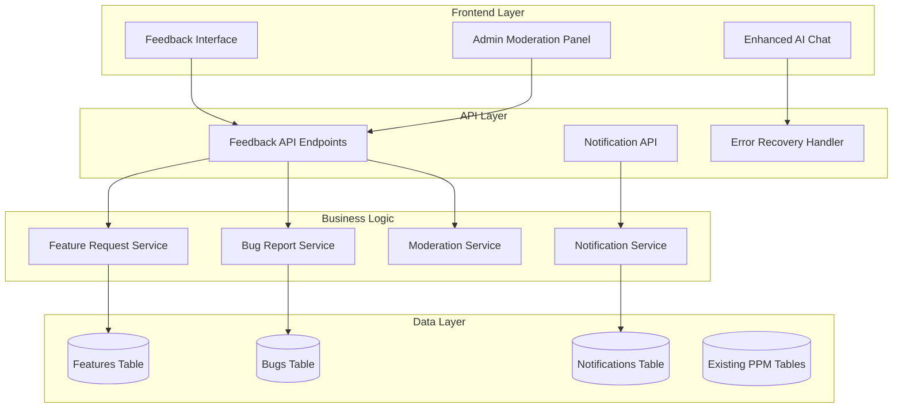

# Design Document: Feedback & Feature Management System

## Overview

The Feedback & Feature Management System extends the AI-powered PPM platform with comprehensive user feedback capabilities, including AI chat error recovery, feature request management, bug reporting, and administrative moderation. The system integrates seamlessly with the existing architecture while providing robust error handling and user engagement features.

## Architecture

### System Components



## Data Models

### Feature Request Entity
```typescript
interface FeatureRequest {
  id: string
  title: string
  description: string
  status: 'submitted' | 'under_review' | 'approved' | 'in_development' | 'completed' | 'rejected'
  priority: 'low' | 'medium' | 'high'
  votes: number
  upvotes: number
  downvotes: number
  comments: FeatureComment[]
  submitted_by: string
  assigned_to?: string
  created_at: Date
  updated_at: Date
  completed_at?: Date
  tags: string[]
}

interface FeatureComment {
  id: string
  feature_id: string
  user_id: string
  content: string
  created_at: Date
}

interface FeatureVote {
  id: string
  feature_id: string
  user_id: string
  vote_type: 'upvote' | 'downvote'
  created_at: Date
}
```

### Bug Report Entity
```typescript
interface BugReport {
  id: string
  title: string
  description: string
  steps_to_reproduce?: string
  expected_behavior?: string
  actual_behavior?: string
  status: 'submitted' | 'confirmed' | 'in_progress' | 'resolved' | 'closed' | 'duplicate'
  priority: 'low' | 'medium' | 'high' | 'critical'
  severity: 'minor' | 'major' | 'critical' | 'blocker'
  category: 'ui' | 'functionality' | 'performance' | 'security' | 'data' | 'integration'
  submitted_by: string
  assigned_to?: string
  duplicate_of?: string
  resolution_notes?: string
  created_at: Date
  updated_at: Date
  resolved_at?: Date
  attachments: BugAttachment[]
}

interface BugAttachment {
  id: string
  bug_id: string
  filename: string
  file_url: string
  file_type: string
  uploaded_at: Date
}
```

### Notification Entity
```typescript
interface Notification {
  id: string
  user_id: string
  type: 'feature_status_change' | 'bug_status_change' | 'comment_added' | 'assignment_change'
  title: string
  message: string
  related_id: string // feature_id or bug_id
  related_type: 'feature' | 'bug'
  read: boolean
  sent_via_email: boolean
  created_at: Date
  read_at?: Date
}
```

## Database Schema

### Features Table
```sql
CREATE TABLE features (
  id UUID PRIMARY KEY DEFAULT gen_random_uuid(),
  title VARCHAR(255) NOT NULL,
  description TEXT NOT NULL,
  status VARCHAR(50) DEFAULT 'submitted' CHECK (status IN ('submitted', 'under_review', 'approved', 'in_development', 'completed', 'rejected')),
  priority VARCHAR(20) DEFAULT 'medium' CHECK (priority IN ('low', 'medium', 'high')),
  votes INTEGER DEFAULT 0,
  upvotes INTEGER DEFAULT 0,
  downvotes INTEGER DEFAULT 0,
  submitted_by UUID REFERENCES auth.users(id) NOT NULL,
  assigned_to UUID REFERENCES auth.users(id),
  tags JSONB DEFAULT '[]',
  metadata JSONB DEFAULT '{}',
  created_at TIMESTAMP WITH TIME ZONE DEFAULT NOW(),
  updated_at TIMESTAMP WITH TIME ZONE DEFAULT NOW(),
  completed_at TIMESTAMP WITH TIME ZONE
);

CREATE TABLE feature_comments (
  id UUID PRIMARY KEY DEFAULT gen_random_uuid(),
  feature_id UUID REFERENCES features(id) ON DELETE CASCADE,
  user_id UUID REFERENCES auth.users(id) NOT NULL,
  content TEXT NOT NULL,
  created_at TIMESTAMP WITH TIME ZONE DEFAULT NOW()
);

CREATE TABLE feature_votes (
  id UUID PRIMARY KEY DEFAULT gen_random_uuid(),
  feature_id UUID REFERENCES features(id) ON DELETE CASCADE,
  user_id UUID REFERENCES auth.users(id) NOT NULL,
  vote_type VARCHAR(10) CHECK (vote_type IN ('upvote', 'downvote')),
  created_at TIMESTAMP WITH TIME ZONE DEFAULT NOW(),
  UNIQUE(feature_id, user_id)
);
```

### Bugs Table
```sql
CREATE TABLE bugs (
  id UUID PRIMARY KEY DEFAULT gen_random_uuid(),
  title VARCHAR(255) NOT NULL,
  description TEXT NOT NULL,
  steps_to_reproduce TEXT,
  expected_behavior TEXT,
  actual_behavior TEXT,
  status VARCHAR(50) DEFAULT 'submitted' CHECK (status IN ('submitted', 'confirmed', 'in_progress', 'resolved', 'closed', 'duplicate')),
  priority VARCHAR(20) DEFAULT 'medium' CHECK (priority IN ('low', 'medium', 'high', 'critical')),
  severity VARCHAR(20) DEFAULT 'minor' CHECK (severity IN ('minor', 'major', 'critical', 'blocker')),
  category VARCHAR(50) DEFAULT 'functionality' CHECK (category IN ('ui', 'functionality', 'performance', 'security', 'data', 'integration')),
  submitted_by UUID REFERENCES auth.users(id) NOT NULL,
  assigned_to UUID REFERENCES auth.users(id),
  duplicate_of UUID REFERENCES bugs(id),
  resolution_notes TEXT,
  metadata JSONB DEFAULT '{}',
  created_at TIMESTAMP WITH TIME ZONE DEFAULT NOW(),
  updated_at TIMESTAMP WITH TIME ZONE DEFAULT NOW(),
  resolved_at TIMESTAMP WITH TIME ZONE
);

CREATE TABLE bug_attachments (
  id UUID PRIMARY KEY DEFAULT gen_random_uuid(),
  bug_id UUID REFERENCES bugs(id) ON DELETE CASCADE,
  filename VARCHAR(255) NOT NULL,
  file_url TEXT NOT NULL,
  file_type VARCHAR(100),
  file_size INTEGER,
  uploaded_at TIMESTAMP WITH TIME ZONE DEFAULT NOW()
);
```

### Notifications Table
```sql
CREATE TABLE notifications (
  id UUID PRIMARY KEY DEFAULT gen_random_uuid(),
  user_id UUID REFERENCES auth.users(id) NOT NULL,
  type VARCHAR(50) NOT NULL,
  title VARCHAR(255) NOT NULL,
  message TEXT NOT NULL,
  related_id UUID,
  related_type VARCHAR(20),
  read BOOLEAN DEFAULT FALSE,
  sent_via_email BOOLEAN DEFAULT FALSE,
  email_sent_at TIMESTAMP WITH TIME ZONE,
  created_at TIMESTAMP WITH TIME ZONE DEFAULT NOW(),
  read_at TIMESTAMP WITH TIME ZONE
);
```

## API Endpoints

### Feature Management Endpoints
```typescript
// Feature CRUD operations
POST   /feedback/features              // Create feature request
GET    /feedback/features              // List features with filtering
GET    /feedback/features/{id}         // Get specific feature
PUT    /feedback/features/{id}         // Update feature (admin only)
DELETE /feedback/features/{id}         // Delete feature (admin only)

// Feature voting
POST   /feedback/features/{id}/vote    // Vote on feature
DELETE /feedback/features/{id}/vote    // Remove vote

// Feature comments
POST   /feedback/features/{id}/comments // Add comment
GET    /feedback/features/{id}/comments // Get comments
```

### Bug Management Endpoints
```typescript
// Bug CRUD operations
POST   /feedback/bugs                  // Create bug report
GET    /feedback/bugs                  // List bugs with filtering
GET    /feedback/bugs/{id}             // Get specific bug
PUT    /feedback/bugs/{id}             // Update bug (admin/assigned user)
DELETE /feedback/bugs/{id}             // Delete bug (admin only)

// Bug attachments
POST   /feedback/bugs/{id}/attachments // Upload attachment
GET    /feedback/bugs/{id}/attachments // Get attachments
DELETE /feedback/bugs/attachments/{id} // Delete attachment
```

### Admin Moderation Endpoints
```typescript
// Admin statistics and management
GET    /feedback/admin/stats           // Get feedback statistics
GET    /feedback/admin/pending         // Get pending items for review
PUT    /feedback/admin/features/{id}/status // Update feature status
PUT    /feedback/admin/bugs/{id}/assign     // Assign bug to developer
GET    /feedback/admin/users/{id}/activity  // Get user feedback activity
```

### Notification Endpoints
```typescript
// Notification management
GET    /notifications                  // Get user notifications
PUT    /notifications/{id}/read        // Mark notification as read
PUT    /notifications/mark-all-read    // Mark all as read
POST   /notifications/preferences      // Update notification preferences
```

## Error Recovery Implementation

### Enhanced AI Chat Error Handling
```typescript
interface ErrorRecoveryState {
  lastQuery: string
  conversationId: string | null
  retryCount: number
  maxRetries: number
  errorHistory: ChatError[]
}

interface ChatError {
  timestamp: Date
  errorType: 'network' | 'server' | 'timeout' | 'auth' | 'unknown'
  message: string
  statusCode?: number
}

class ChatErrorRecovery {
  async handleError(error: ChatError, state: ErrorRecoveryState): Promise<ErrorRecoveryAction>
  async retryLastQuery(state: ErrorRecoveryState): Promise<ChatMessage>
  async suggestAlternatives(state: ErrorRecoveryState): Promise<string[]>
}
```

## Correctness Properties

### Property 1: Feature Vote Integrity
*For any* feature request, the total votes should equal the sum of upvotes and downvotes, and each user can only vote once per feature
**Validates: Requirements 2.2, 2.3**

### Property 2: Bug Status Workflow
*For any* bug report, status transitions should follow valid workflow rules (e.g., cannot go from 'resolved' to 'submitted')
**Validates: Requirements 3.3, 3.4**

### Property 3: Notification Delivery
*For any* status change event, notifications should be created for all interested users and delivery should be tracked
**Validates: Requirements 5.1, 5.2**

### Property 4: Error Recovery Consistency
*For any* chat error, the conversation context should be preserved and retry attempts should maintain the same parameters
**Validates: Requirements 1.2, 1.3, 1.4**

### Property 5: Admin Permission Enforcement
*For any* administrative action, proper permissions should be verified and audit logs should be maintained
**Validates: Requirements 4.2, 4.3, 4.5**

## Testing Strategy

### Unit Tests
- Feature CRUD operations with validation
- Bug report workflow state transitions
- Notification creation and delivery logic
- Error recovery mechanisms
- Permission and authorization checks

### Integration Tests
- End-to-end feature request submission and voting
- Bug report lifecycle from submission to resolution
- Notification delivery across different channels
- Admin moderation workflows
- AI chat error recovery scenarios

### Property-Based Tests
- Feature vote integrity across random voting patterns
- Bug status workflow validation with random state transitions
- Notification delivery consistency with various user configurations
- Error recovery state preservation across different error scenarios
- Permission enforcement across all administrative operations

## Security Considerations

### Data Protection
- All user feedback is protected by Row Level Security (RLS)
- Sensitive bug reports can be marked as private
- File uploads are validated and scanned for security threats
- Personal information in feedback is anonymized for analytics

### Access Control
- Feature voting requires authentication
- Bug assignment requires admin or developer role
- Moderation actions require admin permissions
- Notification preferences are user-specific and protected

### Audit Logging
- All moderation actions are logged with timestamps and user IDs
- Status changes are tracked with reason codes
- File uploads and deletions are audited
- Permission changes are logged for compliance