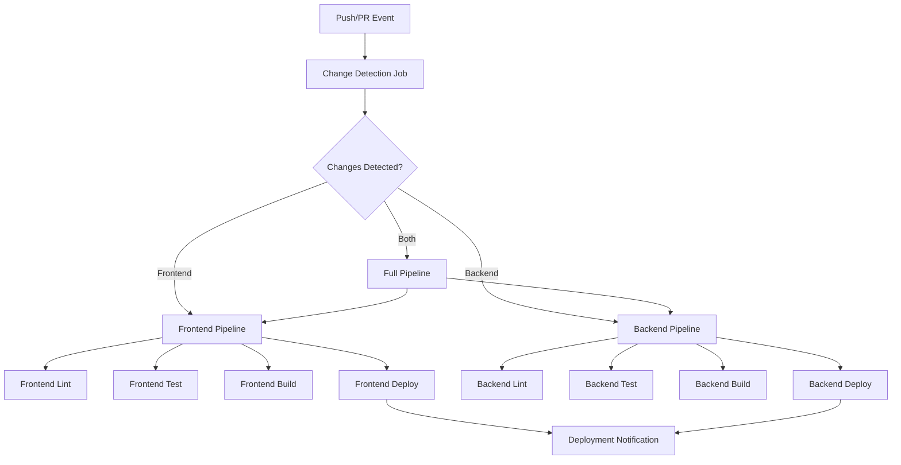

# Design Document: GitHub Actions CI/CD Pipeline

## Overview

This design outlines a comprehensive CI/CD pipeline using GitHub Actions for a monorepo containing a Next.js frontend and FastAPI backend. The pipeline implements intelligent change detection, automated testing, code quality checks, and deployment automation to Vercel (frontend) and Render (backend).

The design emphasizes efficiency through selective execution, security through proper secrets management, and reliability through comprehensive testing including property-based testing with Hypothesis.

## Architecture

### Workflow Structure

The CI/CD pipeline consists of multiple interconnected workflows:



### Repository Structure

The monorepo structure that the CI/CD pipeline will work with:

```
├── .github/
│   └── workflows/
│       ├── ci-cd.yml           # Main CI/CD workflow
│       ├── pr-preview.yml      # Preview deployment workflow
│       └── cleanup.yml         # Cleanup workflow
├── app/                        # Next.js frontend
├── backend/                    # FastAPI backend
├── components/                 # Shared React components
├── lib/                        # Shared utilities
├── package.json               # Frontend dependencies
└── backend/requirements.txt   # Backend dependencies
```

## Components and Interfaces

### 1. Change Detection System

**Purpose**: Intelligently detect which parts of the monorepo have changed to optimize pipeline execution.

**Implementation**: Uses `dorny/paths-filter` action to analyze file changes and set conditional flags.

**Interface**:
```yaml
# Input: Git diff between commits
# Output: Boolean flags for each component
outputs:
  frontend: ${{ steps.filter.outputs.frontend }}
  backend: ${{ steps.filter.outputs.backend }}
  shared: ${{ steps.filter.outputs.shared }}
```

**Path Filters**:
- **Frontend**: `app/**`, `components/**`, `lib/**`, `package.json`, `next.config.ts`, `tailwind.config.ts`
- **Backend**: `backend/**`, `backend/requirements.txt`, `backend/Dockerfile`
- **Shared**: `.github/**`, `README.md`, root configuration files

### 2. Frontend Pipeline

**Linting Component**:
- **Tool**: ESLint with Next.js configuration
- **Configuration**: Uses existing `eslint.config.mjs`
- **Prettier Integration**: Format checking and auto-fixing
- **Command**: `npm run lint` and `npx prettier --check .`

**Testing Component**:
- **Framework**: Jest with React Testing Library
- **Configuration**: Uses existing `jest.config.js`
- **Coverage**: Generates coverage reports with minimum 80% threshold
- **Commands**: `npm test` and `npm run test:coverage`

**Build Component**:
- **Framework**: Next.js build system
- **Output**: Static export for Vercel deployment
- **Validation**: TypeScript compilation check
- **Command**: `npm run build`

**Deployment Component**:
- **Platform**: Vercel
- **Environments**: 
  - Preview (PR branches)
  - Production (main branch)
- **Integration**: Native Vercel GitHub integration with custom deployment triggers

### 3. Backend Pipeline

**Linting Component**:
- **Tools**: Black (formatting) and Flake8 (linting)
- **Configuration**: 
  - Black: `--line-length 88 --target-version py311`
  - Flake8: `--max-line-length 88 --extend-ignore E203,W503`
- **Commands**: `black --check backend/` and `flake8 backend/`

**Testing Component**:
- **Framework**: pytest with asyncio support
- **Property Testing**: Hypothesis for property-based tests
- **Configuration**: Uses existing `backend/pytest.ini`
- **Coverage**: pytest-cov with minimum 85% threshold
- **Commands**: `pytest backend/tests/ --cov=backend --cov-report=xml`

**Build Component**:
- **Validation**: Python dependency resolution and FastAPI startup test
- **Docker**: Optional Docker build validation when Dockerfile changes
- **Health Check**: Startup validation with `/health` endpoint test

**Deployment Component**:
- **Platform**: Render
- **Environments**:
  - Staging (PR branches)
  - Production (main branch)
- **Integration**: Render Deploy Hooks with environment-specific configurations

### 4. Environment Management System

**GitHub Secrets Configuration**:
```yaml
# Frontend Secrets
NEXT_PUBLIC_SUPABASE_URL: ${{ secrets.NEXT_PUBLIC_SUPABASE_URL }}
NEXT_PUBLIC_SUPABASE_ANON_KEY: ${{ secrets.NEXT_PUBLIC_SUPABASE_ANON_KEY }}
NEXT_PUBLIC_API_URL: ${{ secrets.NEXT_PUBLIC_API_URL }}

# Backend Secrets  
SUPABASE_URL: ${{ secrets.SUPABASE_URL }}
SUPABASE_ANON_KEY: ${{ secrets.SUPABASE_ANON_KEY }}
OPENAI_API_KEY: ${{ secrets.OPENAI_API_KEY }}
REDIS_URL: ${{ secrets.REDIS_URL }}

# Deployment Secrets
VERCEL_TOKEN: ${{ secrets.VERCEL_TOKEN }}
VERCEL_ORG_ID: ${{ secrets.VERCEL_ORG_ID }}
VERCEL_PROJECT_ID: ${{ secrets.VERCEL_PROJECT_ID }}
RENDER_API_KEY: ${{ secrets.RENDER_API_KEY }}
RENDER_SERVICE_ID: ${{ secrets.RENDER_SERVICE_ID }}
```

**Environment Validation**:
- Pre-flight checks to ensure required secrets are available
- Environment-specific configuration loading
- Secure handling with no secret exposure in logs

### 5. Caching System

**Node.js Dependencies**:
```yaml
- name: Cache Node.js dependencies
  uses: actions/cache@v4
  with:
    path: ~/.npm
    key: ${{ runner.os }}-node-${{ hashFiles('**/package-lock.json') }}
```

**Python Dependencies**:
```yaml
- name: Cache Python dependencies
  uses: actions/cache@v4
  with:
    path: ~/.cache/pip
    key: ${{ runner.os }}-pip-${{ hashFiles('**/requirements.txt') }}
```

**Next.js Build Cache**:
```yaml
- name: Cache Next.js build
  uses: actions/cache@v4
  with:
    path: ${{ github.workspace }}/.next/cache
    key: ${{ runner.os }}-nextjs-${{ hashFiles('**/package-lock.json') }}
```

## Data Models

### Workflow Configuration Model

```yaml
WorkflowConfig:
  name: string
  triggers:
    - push: [branches]
    - pull_request: [branches]
  jobs:
    - name: string
      runs-on: string
      needs: [string]
      if: condition
      steps: [Step]

Step:
  name: string
  uses?: string
  run?: string
  with?: object
  env?: object
```

### Deployment Status Model

```yaml
DeploymentStatus:
  environment: "preview" | "staging" | "production"
  status: "pending" | "success" | "failure"
  url?: string
  commit_sha: string
  timestamp: datetime
  logs_url?: string
```

### Test Results Model

```yaml
TestResults:
  component: "frontend" | "backend"
  framework: "jest" | "pytest"
  total_tests: number
  passed: number
  failed: number
  coverage_percentage: number
  duration_seconds: number
  property_tests?: PropertyTestResults[]

PropertyTestResults:
  property_name: string
  iterations: number
  status: "passed" | "failed"
  counterexample?: string
  shrunk_example?: string
```

## Correctness Properties

*A property is a characteristic or behavior that should hold true across all valid executions of a system—essentially, a formal statement about what the system should do. Properties serve as the bridge between human-readable specifications and machine-verifiable correctness guarantees.*

After analyzing all acceptance criteria, I found that all requirements are testable as properties since they define specific, verifiable behaviors of the CI/CD system. However, some properties can be consolidated to avoid redundancy:

### Property Reflection

Several properties can be combined for more comprehensive validation:
- Properties 1.2, 1.3, 2.1, 2.2, 2.3, 3.1, 3.2 all test conditional execution and can be combined into comprehensive conditional execution properties
- Properties 1.4, 2.5, 3.4, 5.5 all test failure handling and can be combined
- Properties 7.1, 7.2, 7.3 test selective execution and can be combined
- Performance properties 1.5, 2.6, 3.5, 4.5, 9.3 can be consolidated

### Core Properties

**Property 1: Conditional Pipeline Execution**
*For any* code change in the monorepo, the CI/CD pipeline should execute only the jobs relevant to the changed components (frontend, backend, or both), ensuring efficient resource utilization
**Validates: Requirements 1.2, 1.3, 2.1, 2.2, 2.3, 3.1, 3.2, 7.1, 7.2, 7.3**

**Property 2: Comprehensive Failure Handling**
*For any* pipeline failure (linting, testing, building, or deployment), the system should prevent merge, provide detailed error information, and maintain security by not exposing sensitive data
**Validates: Requirements 1.4, 2.5, 3.4, 5.5, 6.4**

**Property 3: Deployment Consistency**
*For any* successful pipeline execution, deployments should only occur when all quality checks pass, with appropriate environment configuration and proper notifications
**Validates: Requirements 4.1, 4.2, 5.1, 5.2, 5.3, 6.5**

**Property 4: Environment Security**
*For any* pipeline execution requiring secrets, environment variables should be accessed securely through GitHub Secrets, validated before use, and never exposed in logs or outputs
**Validates: Requirements 6.1, 6.2, 6.3, 6.4**

**Property 5: Performance and Reliability**
*For any* typical changeset, the pipeline should complete within specified time limits (15 minutes total), maintain 95% success rate for valid builds, and utilize caching to optimize execution time
**Validates: Requirements 1.5, 2.6, 3.5, 4.5, 9.1, 9.3, 9.4**

**Property 6: Comprehensive Reporting**
*For any* pipeline execution, the system should generate appropriate notifications, test coverage reports, deployment status updates, and provide accessible artifacts for analysis
**Validates: Requirements 2.4, 4.3, 8.1, 8.2, 8.3, 8.4**

**Property 7: Resource Cleanup**
*For any* closed pull request, the system should automatically clean up associated preview deployments and temporary resources
**Validates: Requirements 4.4**

**Property 8: Retry Resilience**
*For any* transient failure in external services, the pipeline should implement retry logic and provide metrics for performance analysis when degradation occurs
**Validates: Requirements 9.2, 9.5**

**Property 9: Critical Failure Escalation**
*For any* critical system failure, the pipeline should send notifications to designated team channels with actionable information
**Validates: Requirements 8.5**

**Property 10: Docker Build Validation**
*For any* Dockerfile change, the pipeline should validate Docker container builds for the backend component
**Validates: Requirements 3.3**

## Error Handling

### Pipeline Failure Scenarios

**Linting Failures**:
- Capture ESLint/Prettier errors with file locations and rule violations
- Capture Black/Flake8 errors with formatting suggestions
- Prevent merge until issues are resolved
- Provide actionable fix suggestions in PR comments

**Test Failures**:
- Capture Jest test failures with stack traces and component context
- Capture pytest failures with detailed error messages
- Handle Hypothesis property test failures with counterexamples and shrinking
- Generate test reports with failure analysis
- Maintain test history for regression analysis

**Build Failures**:
- Capture Next.js build errors with module resolution issues
- Capture FastAPI startup failures with dependency conflicts
- Handle Docker build failures with layer-specific error messages
- Provide build logs with timestamps and resource usage

**Deployment Failures**:
- Handle Vercel deployment failures with rollback procedures
- Handle Render deployment failures with health check validation
- Implement deployment retry logic with exponential backoff
- Maintain deployment history and rollback capabilities

### Security Error Handling

**Secret Management Failures**:
- Validate required secrets before pipeline execution
- Handle missing secrets with clear error messages
- Prevent pipeline execution with incomplete configuration
- Never log secret values or expose them in error messages

**Environment Validation Failures**:
- Validate environment-specific configuration
- Handle database connection failures in test environments
- Provide environment-specific troubleshooting guides
- Implement graceful degradation for non-critical services

### Recovery Mechanisms

**Automatic Retry Logic**:
- Retry transient network failures up to 3 times with exponential backoff
- Retry external service failures (Vercel, Render APIs) with circuit breaker pattern
- Skip retry for deterministic failures (syntax errors, test failures)
- Log retry attempts with failure reasons and success/failure outcomes

**Rollback Procedures**:
- Automatic rollback for failed production deployments
- Manual rollback triggers for emergency situations
- Rollback validation with health checks and smoke tests
- Rollback notification to team channels with status updates

## Testing Strategy

### Dual Testing Approach

The CI/CD pipeline testing strategy employs both unit testing and property-based testing to ensure comprehensive coverage and reliability:

**Unit Tests**:
- Test specific workflow configurations and job definitions
- Test individual pipeline components (linting, testing, building, deployment)
- Test error handling scenarios with known failure conditions
- Test integration points between GitHub Actions and external services
- Validate environment configuration and secret management

**Property-Based Tests**:
- Test pipeline behavior across different changeset patterns and sizes
- Test conditional execution logic with various file change combinations
- Test performance characteristics across different repository states
- Test failure handling with generated error conditions
- Test security properties with various secret and environment configurations

### Testing Framework Configuration

**GitHub Actions Testing**:
- Use `act` for local GitHub Actions workflow testing
- Implement workflow validation with `actionlint`
- Use GitHub's workflow testing features for integration testing
- Minimum 100 iterations per property test for reliability validation

**Property Test Configuration**:
- Each property test must reference its design document property
- Tag format: **Feature: github-actions-cicd, Property {number}: {property_text}**
- Use Hypothesis for Python-based pipeline testing components
- Use fast-check for JavaScript-based configuration testing
- Configure tests to run minimum 100 iterations per property

**Test Environment Setup**:
- Use test-specific GitHub repositories for pipeline validation
- Mock external services (Vercel, Render) for isolated testing
- Use test databases and environments for integration testing
- Implement test data cleanup and isolation between test runs

### Coverage Requirements

**Workflow Coverage**:
- 100% coverage of all workflow paths and conditional logic
- Coverage of all error handling and recovery scenarios
- Coverage of all environment and deployment configurations
- Coverage of all notification and reporting mechanisms

**Integration Coverage**:
- Test all external service integrations (Vercel, Render, GitHub APIs)
- Test all secret and environment variable configurations
- Test all caching and performance optimization features
- Test all monitoring and alerting mechanisms

### Performance Testing

**Execution Time Validation**:
- Validate pipeline completion within specified time limits
- Test caching effectiveness and build time optimization
- Monitor resource usage and identify performance bottlenecks
- Test parallel execution and job dependency optimization

**Reliability Testing**:
- Test pipeline success rates with various changeset patterns
- Test retry logic and failure recovery mechanisms
- Test system behavior under load and concurrent execution
- Validate deployment consistency and rollback procedures