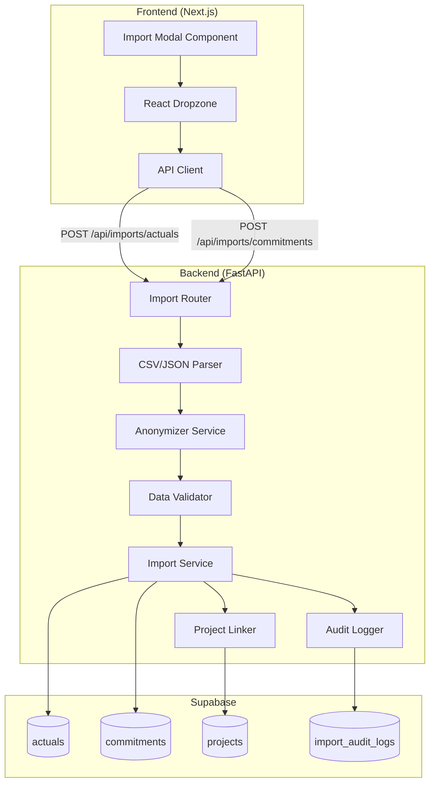

# Design Document: Import Actuals and Commitments

## Overview

This design document describes the technical architecture for importing financial actuals and commitments data into the PPM SaaS application. The feature enables users to upload CSV/JSON files containing financial transaction data, which is then validated, anonymized (if needed), and stored in Supabase with automatic project linking.

The implementation follows existing patterns in the codebase, leveraging FastAPI for backend endpoints, Pydantic for data validation, and React with react-dropzone for the frontend interface.

## Architecture



## Components and Interfaces

### Backend Components

#### 1. Import Router (`backend/routers/imports.py`)

The router exposes REST endpoints for importing actuals and commitments data.

```python
from fastapi import APIRouter, HTTPException, Depends, UploadFile, File
from typing import List, Dict, Any, Optional
from uuid import UUID

router = APIRouter(prefix="/api/imports", tags=["imports"])

@router.post("/actuals")
async def import_actuals(
    file: UploadFile = File(...),
    anonymize: bool = True,
    current_user = Depends(require_permission(Permission.data_import))
) -> ImportResult:
    """Import actuals from CSV/JSON file"""
    pass

@router.post("/commitments")
async def import_commitments(
    file: UploadFile = File(...),
    anonymize: bool = True,
    current_user = Depends(require_permission(Permission.data_import))
) -> ImportResult:
    """Import commitments from CSV/JSON file"""
    pass

@router.get("/templates/{import_type}")
async def get_import_template(
    import_type: str,
    current_user = Depends(get_current_user)
) -> Dict[str, Any]:
    """Get CSV template for import type"""
    pass

@router.get("/history")
async def get_import_history(
    import_type: Optional[str] = None,
    limit: int = 50,
    offset: int = 0,
    current_user = Depends(get_current_user)
) -> List[Dict[str, Any]]:
    """Get import history for current user"""
    pass
```

#### 2. Pydantic Models (`backend/models/imports.py`)

```python
from pydantic import BaseModel, Field, validator
from datetime import date, datetime
from typing import Optional, List
from uuid import UUID
from decimal import Decimal

class ActualCreate(BaseModel):
    fi_doc_no: str = Field(..., description="Financial Document Number")
    posting_date: date
    document_date: Optional[date] = None
    vendor: str
    vendor_description: Optional[str] = None
    project_nr: str
    wbs_element: Optional[str] = None
    amount: Decimal
    currency: str = "EUR"
    item_text: Optional[str] = None
    document_type: Optional[str] = None
    
    @validator('amount', pre=True)
    def parse_amount(cls, v):
        if isinstance(v, str):
            return Decimal(v.replace(',', '.'))
        return v

class CommitmentCreate(BaseModel):
    po_number: str = Field(..., description="Purchase Order Number")
    po_date: date
    vendor: str
    vendor_description: Optional[str] = None
    project_nr: str
    wbs_element: Optional[str] = None
    po_net_amount: Decimal
    total_amount: Decimal
    currency: str = "EUR"
    po_status: Optional[str] = None
    po_line_nr: int = 1
    delivery_date: Optional[date] = None
    
class ImportResult(BaseModel):
    success: bool
    import_id: str
    total_records: int
    success_count: int
    duplicate_count: int
    error_count: int
    errors: List[Dict[str, Any]] = []
    message: str

class ImportAuditLog(BaseModel):
    id: UUID
    import_id: str
    user_id: str
    import_type: str  # "actuals" or "commitments"
    total_records: int
    success_count: int
    duplicate_count: int
    error_count: int
    status: str  # "completed", "failed", "partial"
    errors: Optional[List[Dict]] = None
    created_at: datetime
    completed_at: Optional[datetime] = None
```

#### 3. Anonymizer Service (`backend/services/anonymizer.py`)

```python
from typing import Dict, List, Any
import re

class AnonymizerService:
    def __init__(self):
        self.vendor_map: Dict[str, str] = {}
        self.project_map: Dict[str, str] = {}
        self.personnel_map: Dict[str, str] = {}
        self.vendor_counter = 0
        self.project_counter = 0
        self.personnel_counter = 0
    
    def anonymize_vendor(self, vendor: str) -> str:
        """Replace vendor name with generic identifier"""
        if vendor not in self.vendor_map:
            self.vendor_counter += 1
            self.vendor_map[vendor] = f"Vendor {chr(64 + self.vendor_counter)}"
        return self.vendor_map[vendor]
    
    def anonymize_project_nr(self, project_nr: str) -> str:
        """Replace project number with fictitious format"""
        if project_nr not in self.project_map:
            self.project_counter += 1
            self.project_map[project_nr] = f"P{self.project_counter:04d}"
        return self.project_map[project_nr]
    
    def anonymize_personnel(self, personnel_nr: str) -> str:
        """Replace personnel number with anonymized identifier"""
        if personnel_nr not in self.personnel_map:
            self.personnel_counter += 1
            self.personnel_map[personnel_nr] = f"EMP{self.personnel_counter:03d}"
        return self.personnel_map[personnel_nr]
    
    def anonymize_text(self, text: str) -> str:
        """Replace descriptive text with generic placeholder"""
        return "Item Description"
    
    def anonymize_actual(self, record: Dict[str, Any]) -> Dict[str, Any]:
        """Anonymize a single actual record"""
        pass
    
    def anonymize_commitment(self, record: Dict[str, Any]) -> Dict[str, Any]:
        """Anonymize a single commitment record"""
        pass
```

#### 4. Import Service (`backend/services/import_service.py`)

```python
from typing import List, Dict, Any, Tuple
from uuid import UUID, uuid4
from datetime import datetime

class ActualsCommitmentsImportService:
    def __init__(self, db_session, user_id: str):
        self.db = db_session
        self.user_id = user_id
        self.anonymizer = AnonymizerService()
        self.project_linker = ProjectLinker(db_session)
    
    async def import_actuals(
        self,
        records: List[Dict[str, Any]],
        anonymize: bool = True
    ) -> ImportResult:
        """Import actuals records with validation and duplicate detection"""
        pass
    
    async def import_commitments(
        self,
        records: List[Dict[str, Any]],
        anonymize: bool = True
    ) -> ImportResult:
        """Import commitments records with validation and duplicate detection"""
        pass
    
    async def check_duplicate_actual(self, fi_doc_no: str) -> bool:
        """Check if actual with fi_doc_no already exists"""
        pass
    
    async def check_duplicate_commitment(
        self, po_number: str, po_line_nr: int
    ) -> bool:
        """Check if commitment with po_number+po_line_nr already exists"""
        pass
    
    async def log_import(
        self,
        import_id: str,
        import_type: str,
        result: ImportResult
    ) -> None:
        """Log import operation to audit table"""
        pass
```

#### 5. Project Linker (`backend/services/project_linker.py`)

```python
from typing import Optional, Dict, Any
from uuid import UUID, uuid4

class ProjectLinker:
    def __init__(self, db_session):
        self.db = db_session
        self.project_cache: Dict[str, UUID] = {}
    
    async def get_or_create_project(
        self,
        project_nr: str,
        wbs_element: Optional[str] = None
    ) -> UUID:
        """Get existing project or create new one"""
        if project_nr in self.project_cache:
            return self.project_cache[project_nr]
        
        # Check if project exists
        existing = await self._find_project_by_nr(project_nr)
        if existing:
            self.project_cache[project_nr] = existing
            return existing
        
        # Create new project
        new_project_id = await self._create_project(project_nr, wbs_element)
        self.project_cache[project_nr] = new_project_id
        return new_project_id
    
    async def _find_project_by_nr(self, project_nr: str) -> Optional[UUID]:
        """Find project by project number"""
        pass
    
    async def _create_project(
        self,
        project_nr: str,
        wbs_element: Optional[str]
    ) -> UUID:
        """Create new project with default values"""
        pass
```

### Frontend Components

#### 1. Import Modal Component (`components/imports/ImportModal.tsx`)

```typescript
interface ImportModalProps {
  isOpen: boolean;
  onClose: () => void;
  onImportComplete?: (result: ImportResult) => void;
}

interface ImportResult {
  success: boolean;
  import_id: string;
  total_records: number;
  success_count: number;
  duplicate_count: number;
  error_count: number;
  errors: ImportError[];
  message: string;
}

interface ImportError {
  row: number;
  field: string;
  value: any;
  error: string;
}
```

#### 2. Import Type Selector

```typescript
type ImportType = 'actuals' | 'commitments';

interface ImportTypeSelectorProps {
  selected: ImportType;
  onSelect: (type: ImportType) => void;
}
```

## Data Models

### Actuals Table Schema

```sql
CREATE TABLE actuals (
    id UUID PRIMARY KEY DEFAULT gen_random_uuid(),
    fi_doc_no VARCHAR(50) NOT NULL,
    posting_date DATE NOT NULL,
    document_date DATE,
    vendor VARCHAR(255) NOT NULL,
    vendor_description VARCHAR(500),
    project_id UUID REFERENCES projects(id),
    project_nr VARCHAR(50) NOT NULL,
    wbs_element VARCHAR(100),
    amount DECIMAL(15, 2) NOT NULL,
    currency VARCHAR(3) DEFAULT 'EUR',
    item_text TEXT,
    document_type VARCHAR(50),
    created_at TIMESTAMP WITH TIME ZONE DEFAULT NOW(),
    updated_at TIMESTAMP WITH TIME ZONE DEFAULT NOW(),
    
    CONSTRAINT unique_fi_doc_no UNIQUE (fi_doc_no)
);

CREATE INDEX idx_actuals_project_id ON actuals(project_id);
CREATE INDEX idx_actuals_project_nr ON actuals(project_nr);
CREATE INDEX idx_actuals_posting_date ON actuals(posting_date);
CREATE INDEX idx_actuals_fi_doc_no ON actuals(fi_doc_no);
```

### Commitments Table Schema

```sql
CREATE TABLE commitments (
    id UUID PRIMARY KEY DEFAULT gen_random_uuid(),
    po_number VARCHAR(50) NOT NULL,
    po_date DATE NOT NULL,
    vendor VARCHAR(255) NOT NULL,
    vendor_description VARCHAR(500),
    project_id UUID REFERENCES projects(id),
    project_nr VARCHAR(50) NOT NULL,
    wbs_element VARCHAR(100),
    po_net_amount DECIMAL(15, 2) NOT NULL,
    total_amount DECIMAL(15, 2) NOT NULL,
    currency VARCHAR(3) DEFAULT 'EUR',
    po_status VARCHAR(50),
    po_line_nr INTEGER DEFAULT 1,
    delivery_date DATE,
    created_at TIMESTAMP WITH TIME ZONE DEFAULT NOW(),
    updated_at TIMESTAMP WITH TIME ZONE DEFAULT NOW(),
    
    CONSTRAINT unique_po_line UNIQUE (po_number, po_line_nr)
);

CREATE INDEX idx_commitments_project_id ON commitments(project_id);
CREATE INDEX idx_commitments_project_nr ON commitments(project_nr);
CREATE INDEX idx_commitments_po_number ON commitments(po_number);
CREATE INDEX idx_commitments_po_date ON commitments(po_date);
```

### Import Audit Logs Table Schema

```sql
CREATE TABLE import_audit_logs (
    id UUID PRIMARY KEY DEFAULT gen_random_uuid(),
    import_id VARCHAR(100) NOT NULL,
    user_id VARCHAR(100) NOT NULL,
    import_type VARCHAR(20) NOT NULL,
    total_records INTEGER NOT NULL DEFAULT 0,
    success_count INTEGER NOT NULL DEFAULT 0,
    duplicate_count INTEGER NOT NULL DEFAULT 0,
    error_count INTEGER NOT NULL DEFAULT 0,
    status VARCHAR(20) NOT NULL DEFAULT 'pending',
    errors JSONB,
    created_at TIMESTAMP WITH TIME ZONE DEFAULT NOW(),
    completed_at TIMESTAMP WITH TIME ZONE,
    
    CONSTRAINT valid_import_type CHECK (import_type IN ('actuals', 'commitments')),
    CONSTRAINT valid_status CHECK (status IN ('pending', 'processing', 'completed', 'failed', 'partial'))
);

CREATE INDEX idx_import_audit_user_id ON import_audit_logs(user_id);
CREATE INDEX idx_import_audit_import_type ON import_audit_logs(import_type);
CREATE INDEX idx_import_audit_created_at ON import_audit_logs(created_at DESC);
```


## Correctness Properties

*A property is a characteristic or behavior that should hold true across all valid executions of a system—essentially, a formal statement about what the system should do. Properties serve as the bridge between human-readable specifications and machine-verifiable correctness guarantees.*

### Property 1: Anonymization Consistency

*For any* vendor name, project number, or personnel number that appears multiple times in an import dataset, the Anonymizer SHALL produce the same anonymized value for each occurrence within the same import session.

**Validates: Requirements 1.7**

### Property 2: Anonymization Preserves Non-Sensitive Fields

*For any* import record, the Anonymizer SHALL preserve dates, amounts, currency codes, and status fields unchanged while transforming vendor names, project numbers, personnel numbers, and descriptive text.

**Validates: Requirements 1.6**

### Property 3: Vendor Anonymization Format

*For any* vendor name input, the Anonymizer SHALL produce an output matching the pattern "Vendor [A-Z]+" where the letter increments for each unique vendor.

**Validates: Requirements 1.1**

### Property 4: Project Number Anonymization Format

*For any* project number input, the Anonymizer SHALL produce an output matching the pattern "P[0-9]{4}" (e.g., P0001, P0002) where the number increments for each unique project.

**Validates: Requirements 1.3**

### Property 5: Import Round-Trip for Actuals

*For any* valid actuals record that is imported, querying the actuals table by fi_doc_no SHALL return a record with equivalent field values (accounting for anonymization if enabled).

**Validates: Requirements 2.2**

### Property 6: Import Round-Trip for Commitments

*For any* valid commitments record that is imported, querying the commitments table by po_number and po_line_nr SHALL return a record with equivalent field values (accounting for anonymization if enabled).

**Validates: Requirements 3.2**

### Property 7: Validation Error Completeness

*For any* import record with invalid data (missing required fields, non-numeric amounts, or invalid date formats), the Import_Service SHALL return an error response containing the row number, field name, and invalid value.

**Validates: Requirements 2.4, 2.5, 2.6, 3.4, 3.5, 3.6**

### Property 8: Format Equivalence

*For any* dataset, importing via CSV format and importing via JSON format SHALL produce equivalent records in the database (same field values, same count).

**Validates: Requirements 2.7, 3.7**

### Property 9: Duplicate Detection Idempotency

*For any* import operation, importing the same dataset twice SHALL result in the second import detecting all records as duplicates, with duplicate_count equal to total_records and success_count equal to zero.

**Validates: Requirements 4.1, 4.2, 4.3, 4.4**

### Property 10: Import Summary Accuracy

*For any* import operation, the returned ImportResult SHALL have total_records equal to success_count + duplicate_count + error_count.

**Validates: Requirements 4.5**

### Property 11: Project Linking Consistency

*For any* import record with a project_nr, the resulting database record SHALL have a non-null project_id that references a valid project in the projects table.

**Validates: Requirements 6.1, 6.2**

### Property 12: Auto-Created Project Defaults

*For any* project auto-created during import, the project SHALL have status='active' and health='green'.

**Validates: Requirements 6.3**

### Property 13: Audit Log Completeness

*For any* import operation (successful, failed, or partial), an audit log entry SHALL be created containing import_id, user_id, import_type, total_records, success_count, duplicate_count, error_count, and status.

**Validates: Requirements 5.4, 10.1, 10.2, 10.3**

### Property 14: Invalid File Format Rejection

*For any* file with an extension other than .csv or .json, the Import_Service SHALL return an error response specifying accepted formats.

**Validates: Requirements 9.1**

### Property 15: Partial Import Error Collection

*For any* import with some valid and some invalid records, the Import_Service SHALL import all valid records and return a list of all errors with row numbers.

**Validates: Requirements 9.3, 9.5**

## Error Handling

### Error Categories

1. **Authentication Errors (401)**
   - Missing JWT token
   - Expired JWT token
   - Invalid JWT signature

2. **Authorization Errors (403)**
   - User lacks `data_import` permission

3. **Validation Errors (400)**
   - Missing required fields
   - Invalid data types (non-numeric amounts)
   - Invalid date formats
   - Invalid file format

4. **Parsing Errors (400)**
   - Malformed CSV (unclosed quotes, wrong delimiter)
   - Invalid JSON structure
   - Encoding issues

5. **Database Errors (500)**
   - Connection failures
   - Constraint violations
   - Transaction failures

### Error Response Format

```json
{
  "success": false,
  "import_id": "import-actuals-1234567890",
  "total_records": 100,
  "success_count": 0,
  "duplicate_count": 0,
  "error_count": 5,
  "errors": [
    {
      "row": 3,
      "field": "amount",
      "value": "invalid",
      "error": "Amount must be a numeric value"
    },
    {
      "row": 7,
      "field": "posting_date",
      "value": "2024/01/15",
      "error": "Date must be in YYYY-MM-DD format"
    }
  ],
  "message": "Import failed with 5 validation errors"
}
```

### Error Recovery Strategies

1. **Partial Import Mode**: Continue processing valid records, collect all errors
2. **Strict Mode**: Fail entire import on first error (optional)
3. **Retry Logic**: Automatic retry for transient database errors
4. **Rollback**: Full transaction rollback on critical errors

## Testing Strategy

### Unit Tests

Unit tests focus on individual components in isolation:

1. **Anonymizer Service Tests**
   - Test vendor name anonymization
   - Test project number transformation
   - Test personnel number anonymization
   - Test text replacement
   - Test field preservation (dates, amounts)

2. **Validator Tests**
   - Test required field validation
   - Test amount parsing (various formats)
   - Test date parsing (various formats)
   - Test error message generation

3. **Parser Tests**
   - Test CSV parsing with semicolon delimiter
   - Test JSON parsing
   - Test handling of quoted fields
   - Test encoding detection

4. **Project Linker Tests**
   - Test finding existing projects
   - Test creating new projects
   - Test default value assignment

### Property-Based Tests

Property-based tests verify universal properties across many generated inputs. Each test should run a minimum of 100 iterations.

**Testing Framework**: pytest with hypothesis for Python backend

1. **Anonymization Properties**
   - Tag: **Feature: import-actuals-commitments, Property 1: Anonymization Consistency**
   - Tag: **Feature: import-actuals-commitments, Property 2: Anonymization Preserves Non-Sensitive Fields**
   - Tag: **Feature: import-actuals-commitments, Property 3: Vendor Anonymization Format**
   - Tag: **Feature: import-actuals-commitments, Property 4: Project Number Anonymization Format**

2. **Import Round-Trip Properties**
   - Tag: **Feature: import-actuals-commitments, Property 5: Import Round-Trip for Actuals**
   - Tag: **Feature: import-actuals-commitments, Property 6: Import Round-Trip for Commitments**

3. **Validation Properties**
   - Tag: **Feature: import-actuals-commitments, Property 7: Validation Error Completeness**

4. **Format Properties**
   - Tag: **Feature: import-actuals-commitments, Property 8: Format Equivalence**

5. **Duplicate Detection Properties**
   - Tag: **Feature: import-actuals-commitments, Property 9: Duplicate Detection Idempotency**
   - Tag: **Feature: import-actuals-commitments, Property 10: Import Summary Accuracy**

6. **Project Linking Properties**
   - Tag: **Feature: import-actuals-commitments, Property 11: Project Linking Consistency**
   - Tag: **Feature: import-actuals-commitments, Property 12: Auto-Created Project Defaults**

7. **Audit Properties**
   - Tag: **Feature: import-actuals-commitments, Property 13: Audit Log Completeness**

8. **Error Handling Properties**
   - Tag: **Feature: import-actuals-commitments, Property 14: Invalid File Format Rejection**
   - Tag: **Feature: import-actuals-commitments, Property 15: Partial Import Error Collection**

### Integration Tests

Integration tests verify end-to-end flows:

1. **Full Import Flow**
   - Upload CSV → Parse → Validate → Anonymize → Import → Verify in DB

2. **Authentication Flow**
   - Test with valid token
   - Test with missing token
   - Test with expired token

3. **Authorization Flow**
   - Test with data_import permission
   - Test without data_import permission

4. **Frontend Integration**
   - Test file upload via dropzone
   - Test progress display
   - Test error display
   - Test success display

### Test Data Generation

For property-based tests, use hypothesis strategies to generate:

```python
from hypothesis import strategies as st

# Generate valid actuals records
actuals_strategy = st.fixed_dictionaries({
    'fi_doc_no': st.text(min_size=1, max_size=50),
    'posting_date': st.dates(),
    'vendor': st.text(min_size=1, max_size=255),
    'project_nr': st.text(min_size=1, max_size=50),
    'amount': st.decimals(min_value=-1000000, max_value=1000000, places=2),
    'currency': st.sampled_from(['EUR', 'USD', 'CHF']),
})

# Generate valid commitments records
commitments_strategy = st.fixed_dictionaries({
    'po_number': st.text(min_size=1, max_size=50),
    'po_date': st.dates(),
    'vendor': st.text(min_size=1, max_size=255),
    'project_nr': st.text(min_size=1, max_size=50),
    'po_net_amount': st.decimals(min_value=0, max_value=1000000, places=2),
    'total_amount': st.decimals(min_value=0, max_value=1000000, places=2),
    'currency': st.sampled_from(['EUR', 'USD', 'CHF']),
    'po_line_nr': st.integers(min_value=1, max_value=100),
})
```
