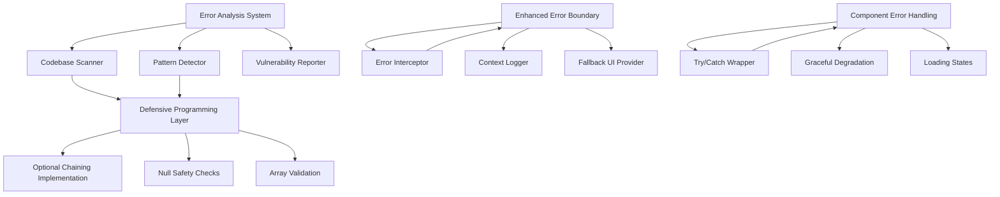
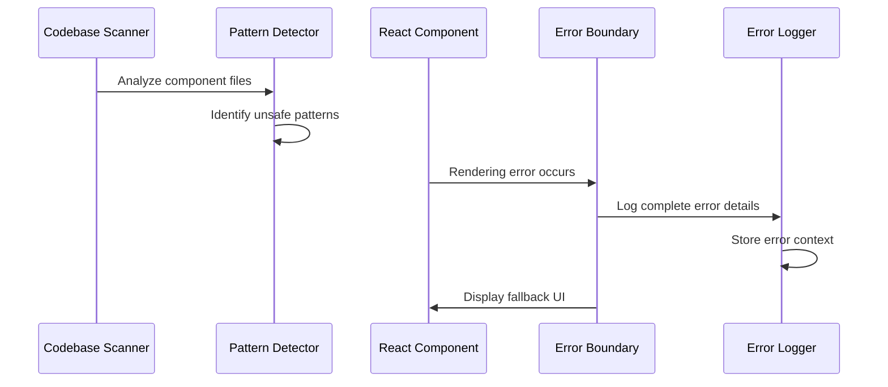

# Design Document: React Rendering Error Fixes

## Overview

This design document outlines a comprehensive solution for systematically identifying and fixing React rendering errors in the PPM-SaaS monorepo codebase. The solution implements defensive programming practices, enhanced error boundaries, and robust error handling to prevent undefined/null property access failures that cause application crashes.

## Architecture

### System Components



### Error Detection Flow



## Components and Interfaces

### 1. Error Analysis System

**Purpose**: Systematically scan and analyze the codebase for potential rendering error sources.

**Key Components**:
- **Codebase Scanner**: Traverses all `.tsx` files to identify components and pages
- **Pattern Detector**: Uses regex and AST analysis to find unsafe property access patterns
- **Vulnerability Reporter**: Generates comprehensive reports of identified issues

**Interface**:
```typescript
interface ErrorAnalysisSystem {
  scanCodebase(): Promise<AnalysisResult>
  detectUnsafePatterns(filePath: string): UnsafePattern[]
  generateReport(results: AnalysisResult[]): VulnerabilityReport
}

interface UnsafePattern {
  type: 'direct_property_access' | 'array_method_call' | 'api_response_handling'
  location: { file: string; line: number; column: number }
  code: string
  severity: 'high' | 'medium' | 'low'
  suggestion: string
}
```

### 2. Defensive Programming Layer

**Purpose**: Implement safe property access and null checking throughout the codebase.

**Key Patterns**:
- Optional chaining (`?.`) for property access
- Array validation before method calls
- API response structure validation
- Fallback values for undefined data

**Implementation Strategy**:
```typescript
// Before (unsafe)
const userName = user.profile.name
const projectCount = projects.length

// After (safe)
const userName = user?.profile?.name || 'Unknown User'
const projectCount = Array.isArray(projects) ? projects.length : 0
```

### 3. Enhanced Error Boundary System

**Purpose**: Provide comprehensive error catching, logging, and user feedback.

**Components**:
- **Error Interceptor**: Captures and processes all rendering errors
- **Context Logger**: Logs detailed error information with component context
- **Fallback UI Provider**: Displays user-friendly error messages

**Enhanced intercept-console-error.ts**:
```typescript
interface EnhancedErrorInfo {
  message: string
  stack: string
  componentStack: string
  errorBoundary: string
  errorInfo: React.ErrorInfo
  timestamp: string
  userAgent: string
  url: string
}
```

### 4. Component Error Handling

**Purpose**: Implement robust error handling within individual components.

**Patterns**:
- Try/catch blocks for async operations
- Loading and error states
- Graceful degradation for missing data
- User-friendly error messages

## Data Models

### Error Analysis Result
```typescript
interface AnalysisResult {
  filePath: string
  componentName: string
  unsafePatterns: UnsafePattern[]
  riskScore: number
  recommendations: string[]
}

interface VulnerabilityReport {
  totalFiles: number
  totalIssues: number
  highSeverityIssues: number
  issuesByType: Record<string, number>
  affectedComponents: string[]
  recommendations: string[]
  generatedAt: string
}
```

### Component Safety Status
```typescript
interface ComponentSafetyStatus {
  componentPath: string
  hasSafePropertyAccess: boolean
  hasArrayValidation: boolean
  hasApiErrorHandling: boolean
  hasLoadingStates: boolean
  safetyScore: number
}
```

## Correctness Properties

*A property is a characteristic or behavior that should hold true across all valid executions of a system-essentially, a formal statement about what the system should do. Properties serve as the bridge between human-readable specifications and machine-verifiable correctness guarantees.*

### Property 1: Codebase Analysis Completeness
*For any* React component or page file in the codebase, the error analysis system should identify all unsafe property access patterns and generate appropriate recommendations.
**Validates: Requirements 1.1, 1.2, 1.3, 1.4**

### Property 2: Safe Property Access Implementation
*For any* object property access in React components, optional chaining or proper null checks should be used to prevent undefined/null access errors.
**Validates: Requirements 2.1, 2.2**

### Property 3: Array Method Safety
*For any* array method call in React components, Array.isArray() validation should be performed before calling array methods like map, filter, or reduce.
**Validates: Requirements 2.3**

### Property 4: API Response Handling Safety
*For any* API response processing in React components, proper null checks and data extraction should be implemented to handle malformed or missing data.
**Validates: Requirements 2.4, 2.5**

### Property 5: Error Boundary Logging Completeness
*For any* error caught by the error boundary system, complete error information including message, stack trace, and component context should be logged.
**Validates: Requirements 3.1, 3.2, 3.3**

### Property 6: Environment-Specific Error Handling
*For any* error logging scenario, the system should differentiate between development and production environments with appropriate logging levels and user feedback.
**Validates: Requirements 3.4, 3.5**

### Property 7: Component Async Operation Safety
*For any* asynchronous operation in React components, proper try/catch error handling should be implemented to prevent unhandled promise rejections.
**Validates: Requirements 4.1, 4.4**

### Property 8: Graceful Component Degradation
*For any* React component with missing or invalid data, appropriate fallback UI or loading states should be displayed to maintain user experience.
**Validates: Requirements 4.2, 4.3, 4.5**

### Property 9: Consistent Error Handling Patterns
*For any* error handling implementation across the codebase, consistent patterns and practices should be applied to ensure maintainability and reliability.
**Validates: Requirements 5.1, 5.3, 7.1, 7.2**

### Property 10: Application Stability Under Error Conditions
*For any* user interaction or navigation in the application, the system should handle errors gracefully without crashing or displaying broken UI.
**Validates: Requirements 6.2, 6.3, 6.4**

## Error Handling

### Error Categories and Responses

1. **Rendering Errors**
   - Caught by Error Boundaries
   - Logged with full context
   - Fallback UI displayed
   - User can retry or navigate away

2. **API Errors**
   - Handled in component try/catch blocks
   - Appropriate error messages shown
   - Retry mechanisms provided
   - Graceful degradation implemented

3. **Data Validation Errors**
   - Prevented through defensive programming
   - Fallback values provided
   - User informed of data issues
   - Application continues functioning

4. **Development vs Production**
   - Development: Detailed error information, stack traces
   - Production: User-friendly messages, error reporting to monitoring

### Error Recovery Strategies

```typescript
// Component-level error recovery
const ComponentWithErrorHandling = () => {
  const [error, setError] = useState<string | null>(null)
  const [loading, setLoading] = useState(false)
  
  const handleAsyncOperation = async () => {
    try {
      setLoading(true)
      setError(null)
      const result = await apiCall()
      // Process result safely
      const data = Array.isArray(result?.data) ? result.data : []
      return data
    } catch (err) {
      const errorMessage = err instanceof Error ? err.message : 'Unknown error'
      setError(errorMessage)
      return []
    } finally {
      setLoading(false)
    }
  }
  
  if (error) {
    return <ErrorFallback error={error} onRetry={handleAsyncOperation} />
  }
  
  if (loading) {
    return <LoadingSpinner />
  }
  
  return <ComponentContent />
}
```

## Testing Strategy

### Dual Testing Approach
- **Unit Tests**: Verify specific error handling scenarios and edge cases
- **Property Tests**: Verify universal error handling properties across all components

### Unit Testing Focus
- Specific error scenarios (API failures, malformed data)
- Component error boundaries
- Fallback UI rendering
- Error logging functionality

### Property Testing Focus
- Universal error handling patterns across all components
- Safe property access implementation
- Consistent error handling behavior
- Application stability under various error conditions

### Property Test Configuration
- Minimum 100 iterations per property test
- Each property test references its design document property
- Tag format: **Feature: react-rendering-error-fixes, Property {number}: {property_text}**

### Testing Implementation Plan
1. **Error Simulation Tests**: Create tests that simulate various error conditions
2. **Property Access Tests**: Verify safe property access patterns
3. **Error Boundary Tests**: Test error catching and logging functionality
4. **Integration Tests**: Test error handling across component interactions
5. **Performance Tests**: Ensure error handling doesn't impact application performance

### Automated Testing Tools
- Jest for unit testing
- React Testing Library for component testing
- Fast-check for property-based testing
- Custom error simulation utilities
- Automated codebase scanning tools