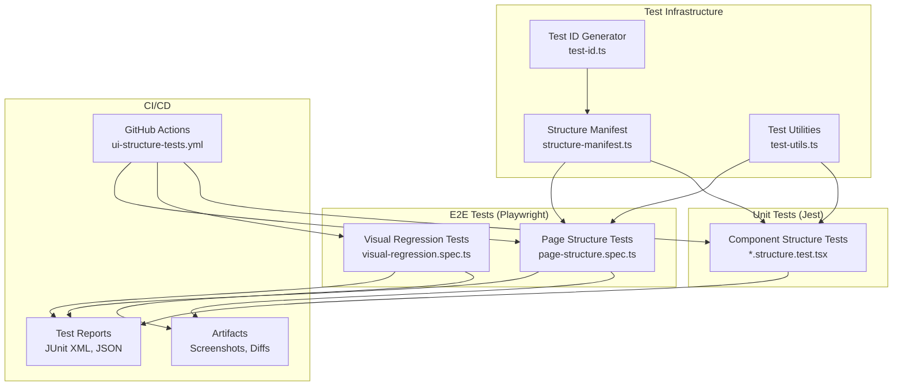

# Design Document: UI Structure Tests

## Overview

This design document outlines the architecture and implementation approach for comprehensive UI structure tests to detect visual regressions and missing UI elements. The system leverages the existing Playwright and Jest infrastructure while adding a structured approach to verifying page and component integrity.

The solution consists of four main components:
1. **Test ID Infrastructure** - Consistent data-testid attributes across components
2. **Page Structure E2E Tests** - Playwright tests verifying page-level structure
3. **Component Structure Unit Tests** - Jest tests verifying component internals
4. **Visual Regression Tests** - Screenshot comparison for visual changes

## Architecture



## Components and Interfaces

### 1. Test ID Generator (`lib/testing/test-id.ts`)

Provides consistent test ID generation following kebab-case naming convention.

```typescript
/**
 * Generates a consistent data-testid value
 * @param component - Component name (e.g., 'variance-kpis')
 * @param element - Element within component (e.g., 'header', 'grid')
 * @param variant - Optional variant (e.g., 'loading', 'error')
 */
export function generateTestId(
  component: string,
  element?: string,
  variant?: string
): string;

/**
 * Creates a test ID builder for a component
 * @param componentName - Base component name
 */
export function createTestIdBuilder(componentName: string): {
  root: () => string;
  element: (name: string) => string;
  variant: (element: string, variant: string) => string;
};

// Example usage:
// const testId = createTestIdBuilder('variance-kpis');
// testId.root() => 'variance-kpis'
// testId.element('header') => 'variance-kpis-header'
// testId.variant('grid', 'loading') => 'variance-kpis-grid-loading'
```

### 2. Structure Manifest (`lib/testing/structure-manifest.ts`)

Defines expected elements for each page and component.

```typescript
export interface ElementDefinition {
  testId: string;
  required: boolean;
  description: string;
  children?: ElementDefinition[];
}

export interface SectionDefinition {
  name: string;
  testId: string;
  required: boolean;
  elements: ElementDefinition[];
}

export interface PageStructure {
  path: string;
  name: string;
  sections: SectionDefinition[];
  conditionalSections?: {
    condition: string;
    sections: SectionDefinition[];
  }[];
}

export interface ComponentStructure {
  name: string;
  testId: string;
  requiredElements: ElementDefinition[];
  optionalElements?: ElementDefinition[];
  states: {
    loading?: ElementDefinition[];
    error?: ElementDefinition[];
    empty?: ElementDefinition[];
  };
}

export const PAGE_STRUCTURES: Record<string, PageStructure>;
export const COMPONENT_STRUCTURES: Record<string, ComponentStructure>;
```

### 3. Test Utilities (`lib/testing/structure-test-utils.ts`)

Reusable helpers for structure verification.

```typescript
import { Page, Locator } from '@playwright/test';
import { render, RenderResult } from '@testing-library/react';

// E2E Utilities (Playwright)
export async function verifyPageStructure(
  page: Page,
  pageStructure: PageStructure
): Promise<StructureVerificationResult>;

export async function verifySection(
  page: Page,
  section: SectionDefinition
): Promise<SectionVerificationResult>;

export async function waitForDynamicContent(
  page: Page,
  options?: { timeout?: number; selector?: string }
): Promise<void>;

export async function captureStructureSnapshot(
  page: Page,
  name: string
): Promise<void>;

// Unit Test Utilities (Jest/RTL)
export function verifyComponentStructure(
  result: RenderResult,
  componentStructure: ComponentStructure
): ComponentVerificationResult;

export function verifyElementsExist(
  result: RenderResult,
  testIds: string[]
): ElementVerificationResult;

// Result Types
export interface StructureVerificationResult {
  passed: boolean;
  missingElements: string[];
  unexpectedElements: string[];
  details: ElementDetail[];
}

export interface ElementDetail {
  testId: string;
  found: boolean;
  visible: boolean;
  accessible: boolean;
}
```

### 4. Page Structure Test Template

```typescript
// __tests__/e2e/page-structure.spec.ts
import { test, expect } from '@playwright/test';
import { PAGE_STRUCTURES } from '@/lib/testing/structure-manifest';
import { verifyPageStructure, waitForDynamicContent } from '@/lib/testing/structure-test-utils';

test.describe('Page Structure Tests', () => {
  for (const [pageName, structure] of Object.entries(PAGE_STRUCTURES)) {
    test(`${pageName} page has all required sections`, async ({ page }) => {
      await page.goto(structure.path);
      await waitForDynamicContent(page);
      
      const result = await verifyPageStructure(page, structure);
      
      expect(result.passed).toBe(true);
      expect(result.missingElements).toEqual([]);
    });
  }
});
```

### 5. Component Structure Test Template

```typescript
// __tests__/component-structure.test.tsx
import { render, screen } from '@testing-library/react';
import { COMPONENT_STRUCTURES } from '@/lib/testing/structure-manifest';
import { verifyComponentStructure } from '@/lib/testing/structure-test-utils';

describe('Component Structure Tests', () => {
  describe('VarianceKPIs', () => {
    const structure = COMPONENT_STRUCTURES['variance-kpis'];
    
    it('renders all required elements with valid data', () => {
      const result = render(<VarianceKPIs session={mockSession} />);
      const verification = verifyComponentStructure(result, structure);
      
      expect(verification.passed).toBe(true);
      expect(verification.missingElements).toEqual([]);
    });
    
    it('renders loading state correctly', () => {
      const result = render(<VarianceKPIs session={null} />);
      
      structure.states.loading?.forEach(element => {
        expect(screen.getByTestId(element.testId)).toBeInTheDocument();
      });
    });
  });
});
```

## Data Models

### Structure Manifest Schema

```typescript
// Complete manifest for a page
const dashboardStructure: PageStructure = {
  path: '/dashboards',
  name: 'Dashboard',
  sections: [
    {
      name: 'Header',
      testId: 'dashboard-header',
      required: true,
      elements: [
        { testId: 'dashboard-title', required: true, description: 'Page title' },
        { testId: 'dashboard-project-count', required: true, description: 'Project count display' },
        { testId: 'dashboard-filter-dropdown', required: true, description: 'Time filter' },
        { testId: 'dashboard-refresh-button', required: true, description: 'Refresh button' },
      ]
    },
    {
      name: 'KPI Cards',
      testId: 'dashboard-kpi-section',
      required: true,
      elements: [
        { testId: 'kpi-card-success-rate', required: true, description: 'Success rate KPI' },
        { testId: 'kpi-card-budget-performance', required: true, description: 'Budget KPI' },
        { testId: 'kpi-card-timeline-performance', required: true, description: 'Timeline KPI' },
        { testId: 'kpi-card-active-projects', required: true, description: 'Active projects KPI' },
        { testId: 'kpi-card-resources', required: true, description: 'Resources KPI' },
      ]
    },
    {
      name: 'Variance Section',
      testId: 'dashboard-variance-section',
      required: true,
      elements: [
        { testId: 'variance-kpis', required: true, description: 'Variance KPIs component' },
        { testId: 'variance-trends', required: true, description: 'Variance trends chart' },
      ]
    },
    {
      name: 'Project Health',
      testId: 'dashboard-health-section',
      required: true,
      elements: [
        { testId: 'health-summary', required: true, description: 'Health summary card' },
        { testId: 'health-healthy-count', required: true, description: 'Healthy projects count' },
        { testId: 'health-at-risk-count', required: true, description: 'At-risk projects count' },
        { testId: 'health-critical-count', required: true, description: 'Critical projects count' },
      ]
    },
    {
      name: 'Recent Projects',
      testId: 'dashboard-projects-section',
      required: true,
      elements: [
        { testId: 'recent-projects-grid', required: true, description: 'Projects grid container' },
      ]
    },
    {
      name: 'Quick Actions',
      testId: 'dashboard-quick-actions',
      required: true,
      elements: [
        { testId: 'action-scenarios', required: true, description: 'Scenarios button' },
        { testId: 'action-resources', required: true, description: 'Resources button' },
        { testId: 'action-financials', required: true, description: 'Financials button' },
        { testId: 'action-reports', required: true, description: 'Reports button' },
        { testId: 'action-import', required: true, description: 'Import button' },
      ]
    }
  ]
};

// Component structure definition
const varianceKpisStructure: ComponentStructure = {
  name: 'VarianceKPIs',
  testId: 'variance-kpis',
  requiredElements: [
    { testId: 'variance-kpis-header', required: true, description: 'Component header' },
    { testId: 'variance-kpis-grid', required: true, description: 'KPI grid container' },
    { testId: 'variance-kpis-net-variance', required: true, description: 'Net variance card' },
    { testId: 'variance-kpis-variance-percent', required: true, description: 'Variance percentage card' },
    { testId: 'variance-kpis-over-budget', required: true, description: 'Over budget count' },
    { testId: 'variance-kpis-under-budget', required: true, description: 'Under budget count' },
    { testId: 'variance-kpis-commitments-actuals', required: true, description: 'Commitments vs Actuals section' },
  ],
  states: {
    loading: [
      { testId: 'variance-kpis-skeleton', required: true, description: 'Loading skeleton' },
    ],
    error: [
      { testId: 'variance-kpis-error', required: true, description: 'Error message' },
    ],
    empty: [
      { testId: 'variance-kpis-empty', required: true, description: 'Empty state message' },
    ]
  }
};
```

### Visual Regression Configuration

```typescript
// Visual regression test configuration
export interface VisualRegressionConfig {
  pages: {
    path: string;
    name: string;
    waitForSelector?: string;
    maskSelectors?: string[];
    viewports: ViewportConfig[];
  }[];
  threshold: number;
  maxDiffPixels: number;
  animations: 'disabled' | 'allow';
}

export interface ViewportConfig {
  name: string;
  width: number;
  height: number;
}

export const VISUAL_REGRESSION_CONFIG: VisualRegressionConfig = {
  pages: [
    { path: '/dashboards', name: 'dashboard', viewports: ['desktop', 'tablet', 'mobile'] },
    { path: '/financials', name: 'financials', viewports: ['desktop', 'tablet', 'mobile'] },
    { path: '/projects', name: 'projects', viewports: ['desktop', 'tablet', 'mobile'] },
    // ... all pages
  ],
  threshold: 0.1,
  maxDiffPixels: 500,
  animations: 'disabled'
};
```

## Correctness Properties

*A property is a characteristic or behavior that should hold true across all valid executions of a system—essentially, a formal statement about what the system should do. Properties serve as the bridge between human-readable specifications and machine-verifiable correctness guarantees.*


### Property 1: Test ID Generation Consistency

*For any* component name and element name combination, the test ID generator SHALL always produce the same kebab-case formatted output, and calling the generator multiple times with identical inputs SHALL return identical results.

**Validates: Requirements 1.1, 1.3**

### Property 2: Page Structure Verification Correctness

*For any* page structure manifest and any set of actually present elements, the verification function SHALL correctly identify all elements that are defined in the manifest but not present in the actual set as "missing", and SHALL not report any false positives.

**Validates: Requirements 2.1**

### Property 3: Component Structure Verification Correctness

*For any* component structure definition and any rendered component output, the verification function SHALL correctly identify whether all required elements are present and report the exact set of missing elements.

**Validates: Requirements 3.1, 3.3**

### Property 4: Conditional State Verification

*For any* component with defined states (loading, error, empty), when the component is in a specific state, the verification function SHALL check for exactly the elements defined for that state in the manifest.

**Validates: Requirements 3.4**

### Property 5: Error Reporting Completeness

*For any* structure verification failure, the error report SHALL contain: the expected element's test ID, the actual state (present/missing/hidden), and a suggested fix action.

**Validates: Requirements 8.1, 2.3**

### Property 6: All Missing Elements Reported

*For any* structure verification where multiple elements are missing, the verification result SHALL contain all missing element test IDs, not just the first one encountered.

**Validates: Requirements 8.3**

### Property 7: Manifest Validation Correctness

*For any* structure manifest, the validation function SHALL accept manifests with valid schema (required, optional, conditional elements) and reject manifests with invalid schema, returning specific validation errors.

**Validates: Requirements 5.2, 5.3**

### Property 8: Visual Diff Threshold Detection

*For any* pair of screenshots and any threshold value, the comparison function SHALL report a failure if and only if the pixel difference exceeds the threshold, and SHALL generate a diff image when the threshold is exceeded.

**Validates: Requirements 4.2, 4.3**

### Property 9: Test Report Format Validity

*For any* test execution result, the generated report SHALL be valid JSON/XML that can be parsed by standard CI tools, and failed tests SHALL result in a non-zero exit code.

**Validates: Requirements 6.2, 6.3**

### Property 10: Summary Report Completeness

*For any* test run covering multiple pages/components, the summary report SHALL include an entry for every tested item with its pass/fail status.

**Validates: Requirements 8.4**

### Property 11: Mock Data Validity

*For any* component type, the mock data generator SHALL produce data that satisfies the component's prop type requirements and can be used to render the component without errors.

**Validates: Requirements 7.5**

### Property 12: Accessibility Verification

*For any* interactive element in the structure manifest, the verification function SHALL check that the element has appropriate accessibility attributes (role, aria-label, etc.) and report accessibility violations.

**Validates: Requirements 2.4, 7.2**

### Property 13: Timeout Error Classification

*For any* test that fails due to timeout, the error report SHALL indicate whether the page loaded partially (some elements found) or not at all (no elements found).

**Validates: Requirements 8.5**

## Error Handling

### Test Execution Errors

| Error Type | Handling Strategy | User Feedback |
|------------|-------------------|---------------|
| Page not loading | Retry with exponential backoff (max 3 attempts) | "Page failed to load after 3 attempts. Check if dev server is running." |
| Element not found | Capture screenshot, continue checking other elements | "Element [testId] not found. Screenshot saved to [path]." |
| Timeout | Classify as partial/full failure | "Test timed out. Page loaded: [partial/none]. Elements found: [count]." |
| Invalid manifest | Fail fast with validation errors | "Manifest validation failed: [specific errors]" |
| Screenshot comparison failure | Generate diff image | "Visual regression detected. Diff saved to [path]." |

### Graceful Degradation

1. **Missing test IDs**: Log warning but don't fail test if element exists by other selector
2. **Flaky elements**: Support retry configuration for elements that may take time to appear
3. **Dynamic content**: Wait for network idle before structure verification
4. **Authentication**: Skip tests gracefully if auth fails, report as "skipped"

## Testing Strategy

### Dual Testing Approach

The UI structure test system uses both unit tests and property-based tests:

**Unit Tests (Jest/React Testing Library)**:
- Verify specific component rendering scenarios
- Test edge cases like empty data, error states
- Validate test utility functions with known inputs/outputs
- Fast feedback during development

**Property-Based Tests (fast-check)**:
- Verify universal properties across generated inputs
- Test ID generation consistency
- Manifest validation with random schemas
- Verification function correctness with random element sets

### Test Configuration

```typescript
// Property test configuration
const PBT_CONFIG = {
  numRuns: 100,  // Minimum 100 iterations per property
  seed: undefined,  // Random seed for reproducibility when debugging
  verbose: true,
  endOnFailure: true
};
```

### Test Tagging Convention

Each property test must include a comment referencing the design property:

```typescript
// Feature: ui-structure-tests, Property 1: Test ID Generation Consistency
test.prop([fc.string(), fc.string()])('generates consistent kebab-case IDs', (component, element) => {
  const id1 = generateTestId(component, element);
  const id2 = generateTestId(component, element);
  expect(id1).toBe(id2);
  expect(id1).toMatch(/^[a-z0-9]+(-[a-z0-9]+)*$/);
});
```

### Test File Organization

```
__tests__/
├── e2e/
│   ├── page-structure.spec.ts          # E2E page structure tests
│   ├── visual-regression.spec.ts       # Visual regression tests
│   └── utils/
│       └── structure-test-helpers.ts   # E2E test utilities
├── unit/
│   ├── test-id-generator.test.ts       # Unit tests for test ID generation
│   ├── test-id-generator.property.test.ts  # Property tests for test ID
│   ├── manifest-validation.test.ts     # Unit tests for manifest validation
│   ├── manifest-validation.property.test.ts  # Property tests for validation
│   ├── structure-verification.test.ts  # Unit tests for verification
│   └── structure-verification.property.test.ts  # Property tests for verification
└── component-structure/
    ├── variance-kpis.structure.test.tsx
    ├── dashboard-kpi-card.structure.test.tsx
    └── ...
```

### CI/CD Integration

```yaml
# .github/workflows/ui-structure-tests.yml
name: UI Structure Tests

on:
  push:
    branches: [main, develop]
  pull_request:
    branches: [main]

jobs:
  structure-tests:
    runs-on: ubuntu-latest
    steps:
      - uses: actions/checkout@v4
      
      - name: Setup Node.js
        uses: actions/setup-node@v4
        with:
          node-version: '20'
          cache: 'npm'
      
      - name: Install dependencies
        run: npm ci
      
      - name: Run unit structure tests
        run: npm run test:structure:unit
      
      - name: Install Playwright browsers
        run: npx playwright install --with-deps
      
      - name: Build application
        run: npm run build
      
      - name: Run E2E structure tests
        run: npm run test:structure:e2e
      
      - name: Run visual regression tests
        run: npm run test:visual
      
      - name: Upload test results
        if: always()
        uses: actions/upload-artifact@v4
        with:
          name: test-results
          path: |
            test-results/
            playwright-report/
      
      - name: Upload visual diff artifacts
        if: failure()
        uses: actions/upload-artifact@v4
        with:
          name: visual-diffs
          path: test-results/visual-diffs/
```

### NPM Scripts

```json
{
  "scripts": {
    "test:structure": "npm run test:structure:unit && npm run test:structure:e2e",
    "test:structure:unit": "jest --testPathPattern='structure|test-id|manifest' --coverage",
    "test:structure:e2e": "playwright test --grep '@structure'",
    "test:visual": "playwright test --grep '@visual'",
    "test:visual:update": "playwright test --grep '@visual' --update-snapshots",
    "test:structure:ci": "npm run test:structure:unit -- --ci && npm run test:structure:e2e -- --reporter=junit"
  }
}
```
